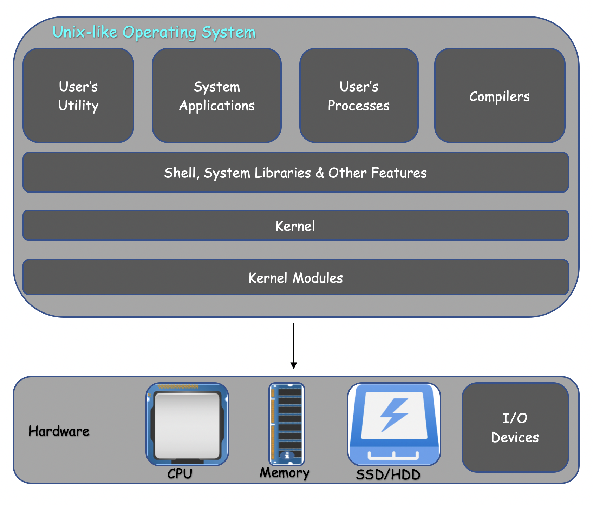
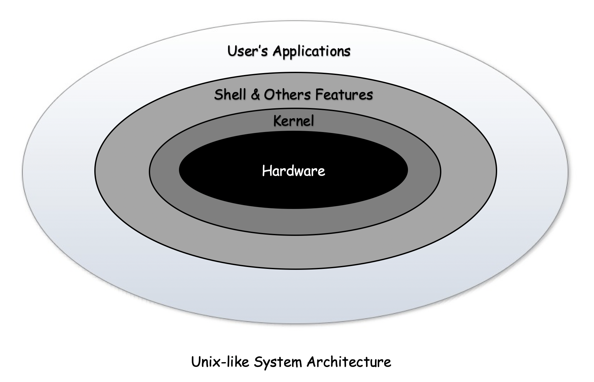

# Introduction to Unix-like System

A Unix-like system is an operating system that behaves in a manner similar to a Unix system, although not necessarily conforming to or being certified to any version of the single Unix specification.

## History of Unix-like System

### Evolution of Unix
  - In the mid **`1960s`**, when the **Massachusetts Institute of Technology**, **AT&T Bell Labs**, and **General Electric** were jointly developing an experimental time-sharing operating system called **Multiplexed Information and Computing Service** ( **`Multics`** ) allowing multiple users to access a mainframe simultaneously. Multics introduced many innovations, but also had many problems.

  - **Bell Labs**, got frustrated by the size and complexity of **`Multics`** and dissatisfied with the project's progress, hence ultimately management withdrew.

  - Their researchers **Ken Thompson**, **Dennis Ritchie**, **Doug McIlroy**, **Brian Kernighan** and **Joe Ossanna** decided to redo the work and in **`in 1969`** launched the **`Unix`** which was much smaller and simpler than **`Multics`**.

  - In **1973**, Version 4 **Unix** was rewritten in the **`higher-level language C`** to make it portable but still had considerable assembly **PDP-11** dependent code , **AT&T** released Version 5 Unix and licensed it to educational institutions, and licensed **1975's** Version 6 to companies for the first time.

  - The availability and portability of **Unix** caused it to be widely adopted, copied and modified by academic institutions and businesses.

  - In **1977**, the **`Berkeley Software Distribution (BSD)`** was developed by the **Computer Systems Research Group (CSRG)** from UC Berkeley, based on the **`6th`** edition of **Unix** from **AT&T**. Since **BSD** contained **Unix** code that **AT&T** owned, **AT&T** filed a lawsuit against the **University of California**. This strongly limited the development and adoption of **BSD**.

  - In **1983** the **Unix** kernel were rewritten in almost all in **higher-level language C** in less than **20,000** lines of code and more than 75% was not machine-dependent. By that year **Unix** or a **Unix-like** system was available for at least **16** different processors and architectures from about 60 vendors.

  - In **1983**, only **Richard Stallman** started the **`GNU project`** with the goal of creating a free **Unix-like** operating system. And he wrote the **GNU General Public License (GPL)**. By the early **1990s**, there was almost enough available software to create a full Operating System. However, the GNU kernel, called **Hurd**, failed to attract enough development effort, leaving **GNU** incomplete.

  - In **1987**, **`MINIX`**, a Unix-like system for academic use was released by **Andrew S. Tanenbaum** to exemplify the principles conveyed in his textbook, **Operating Systems: Design and Implementation**.

 

### Evolution of Linux
  - In **1991**, a computer science student at **`University of Helsinki`**, **Linus Torvalds** began writting the code specifically for his own hardware, he was using and independent of an Operating System because he wanted to use the functions of his new **PC** with an **`80386 processor`**. He has written the code on **`MINIX`** using the **GNU C Compiler** that later became the **Linux kernel**.

  - **Torvalds** first published the **`Linux kernel`** under its own licence, which had a restriction on commercial activity. In **1992**, he released the **kernel** under the GNU General Public License. 
  - The software to use with the **kernel** was developed by the **GNU project** licensed under the **`GNU General Public License`**, a free software license.

  - Linux began to gain importance in **1992** after the **`X Window System`** was ported to Linux by **Orest Zborowski**, which allowed Linux to support a **GUI** for the first time.


## Linux
**Linux** is a family of **`free`** (ensures that the end users have freedom in using, studying, sharing and modifying) and **`open-source`** (rights to study, modify the source code and redistribute to others) Unix-like Operating Systems based on the Linux kernel. The Operation System based on **Linux Kernel** is termed as linux distribution. Some linux distributions are: Debian, Fedora, SUSE, Gentoo, Red Hat Enterprise Linux, Arch Linux and many more.

### Linux Operating System Architecture
An Operating Pystem (OS) is the system software that manages computer hardware, software resources and provides an environment for the users to execute computer programs. It consists of various components to perform specific task / function shown in below figure:

  


### Kernel Modules

The **Kernel Modules** are pieces of code that can be loaded and unloaded into the kernel upon demand. They extend the functionality of the kernel without the need to reboot the system. For example, one type of module is the device driver, which allows the kernel to access hardware connected to the system. Custom codes/modules can be added to **Linux kernel** via two methods:

  - The basic way is to add the code to the kernel source file itself and recompile the **kernel**.
  - A more efficient way is to add module is by adding code to the **kernel** while it is running. A module can be configured as built-in or loadable. To dynamically load or remove a module, it has to be configured as a loadable module in the kernel configuration.

Using modules can save memory, because they are loaded only when the system is actually using them. All parts of the base kernel stay loaded, in real storage, not just virtual storage.

Modules are much faster to maintain and debug.


#### Obtain kernel modules information
Modules are stored in **/usr/lib/modules/$(uname -r)/kernel**. You can use the command **`uname -r`** to get your current kernel release version.

${\color{orange}Note:}$<br>
Module names often use underscores ( **` _ `** ) or dashes ( **` - `**); however, those symbols are interchangeable when using the **modprobe** command and in configuration files in ${\color{green}/etc/modprobe.d/}$.

You can see what modules are already loaded into the kernel by running **`lsmod`**, which gets its information by reading the file ${\color{green}/proc/modules}$.
```
$ lsmod
```
To get information about specific module **`modinfo`** command cab be used:
```
$ modinfo module_name
```

#### Module loading
Today, all necessary modules loading is handled automatically by **`udev`**, so if you do not need to use any out-of-tree kernel modules, there is no need to put modules that should be loaded at boot in any configuration file. However, there are cases where you might want to load an extra module during the boot process, or blacklist another one for your computer to function properly.

**Kernel modules** can be explicitly listed in files under ${\color{green}/etc/modules-load.d/}$ for **systemd** to load them during boot. Each configuration file is named in the style of ${\color{purple}/etc/modules-load.d/program.conf}$. Configuration files simply contain a list of kernel modules names to load, separated by newlines. Empty lines and lines starting with character **` # `** or **` ; `** are ignored.
```
/etc/modules-load.d/virtio-net.conf
------------------------------------------------------------------------------------------------------------------------

# Load virtio_net.ko at boot
virtio_net
```

## kernel

The **Linux kernel** is a free and open-source, monolithic, modular, multitasking, Unix-like operating system kernel. ${\color{green}Kernel}$ is central/core component of an Operating System and generally has complete control over everything in the system. It always resident in memory until Operating System is shut down again and facilitates interactions between hardware and software components. It is responsible for various tasks such as:
  - Device management
  - Memory Management
  - Process Management
  - Security & System Calls

#### Memory Management
Keep track of how much memory is used to store what, how, and where.

#### Device Management
Act as mediator/interpreter between the hardware and processes.

#### Process Management
Determine which processes can use the **Central Processing Unit (CPU)**, when, and for how long.

#### Security & System Calls

Receive requests for service from the processes and provide the approperiate security among various processes.

  - The ${\color{green}kernel}$, is invisible to the user, working in its own little world known as **kernel space**, where it allocates memory and keeps track of where everything is stored. System components, Libraries and user's application like, Web browsers, shell, files, etc are known as the **user space**. These applications interact with the kernel through a **System Call Interface (SCI)**.


### kernel within the OS
To put the kernel in context, you can think of a **Linux** machine as having 3 layers:
  - **The hardware:**<br> 
The physical machine — the bottom or base of the system, made up of memory **(RAM)** and the processor or central processing unit **(CPU)**, as well as input/output **(I/O)** devices such as storage, networking, and graphics. The CPU performs computations and reads from, and writes to, memory.
  - **The Linux kernel:**<br> 
The core of the OS. It’s residing in memory that tells the **CPU** what to do.
  - **User processes:** <br>
These are the running programs that the **kernel** manages. User processes are what collectively make up **user space**. The **kernel** also allows these processes and servers to communicate with each other known as **Inter-process Communication, or IPC.



Code or program executed by the system runs on **CPUs** in 1 of 2 modes: **kernel mode** or **user mode**. Code running in the **kernel mode** has unrestricted access to the hardware, while **user mode** restricts access to the **CPU** and **memory** to the **SCI**. A similar separation exists for memory (**kernel space** and **user space**). These 2 small details form the base for some complicated operations like privilege separation for security, building containers, and virtual machines.


### Kernel Types
The types of kernel are as follow:
  - **Monolithic Kernel –**<br>
The simplest and most common type of **kernel**, the user and kernel services are implemented in the same memory space. It has huge lines of code which is complex.
  - **Micro Kernel –** <br>
Include only the essential services and devices required for the system to function and hence, results in a smaller kernel that is faster and uses less memory. It has separate **User Space** and **kernel Space**.
  - **Hybrid Kernel -**<br>
Combinnation of both **monolithic** and **microkernel** and it borrows speed from the monolithic kernels and modularity from microkernel.
  - **Exo Kernel -** <br>
This Kernel has separate resource protection and management, suitable for use when performing **application-specific** customization.
  - **Nano Kernel -**<br> 
Smallest type of **kernel**, consisting of only a few thousand lines of code. Code executing in the privileged mode of the hardware is minimal. They are used primarily in embedded systems or devices with limited resources.

## Shell
A **Shell** is a **command-line** interpreter or piece of code that provides a command line user interface for **Unix-like** Operating Systems. It accept human readable commands from computer user and convert them into something which kernel can understand. The shell is both an interactive **command language** and a **scripting language**, and is used by the Operating System to control the execution of the system using shell scripts.

There are several shells are available for **Uinux-like systems** like –
  - ksh (Korn Shell)
  - csh (C Shell, Syntax sinilar to C language)
  - sh (Bourne shell)
  - bash (Bourne Again shell) and many more

List of all the available shells in **Unix-like** system is present in the ${\color{purple}/etc/shells}$ file.
```
$ cat /etc/shells
```
  - Path Name : /bin/{sh | bash | csh | ksh} or /usr/bin/{sh | bash | csh | ksh}
  - Prompt for the **root user**: **` # `**
  - Prompt for the **non-root user**: **` $ `**


