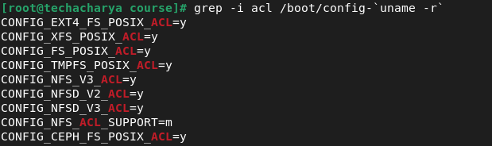

# Access Control Lists (ACLs) in linux
The files and directories have permission sets (a combination of read, write and execute permissions) for the owner of the file, the group associated with the file, and all other users for the system. However, these permission sets have some limitations. For example, different permissions cannot be configured for different users. Access control lists **_(ACLs)_** provide a finer-grained access control mechanism than these traditional Linux access permissions. There are two types of **_ACLs_**:
  - **_access ACLs_**
  - **_default ACLs_**

#### access ACLs
An access **_ACL_** is the access control list for a specific file or directory. 

#### default ACLs
A default ACL can only be associated with a directory and the **_default ACLs_** are optional.

**_ACLs can be configured:_** <br>
  - _Per user_
  - _Per group_
  - _Via the effective rights mask_
  - _For users not in the user group for the file_

The **` setfacl `** and **` getfacl `** utilities are used for setting up **_ACLs_** and retrieving **_ACLs_** respectively.

### Retrieving ALCs
To determine the existing **_ACLs_** for a file or directory, _**` getfacl `**_ commandis is used. When a file does not have an **_ACL_**, it displays the same information as _**` ls –l `**_, although in a different format. To retrieve the access control lists for a file or directory execute the following command:
```
$ getfacl /home/acharya/course/welcome.sh
```


Here, **_welcome.sh_** file and directory **_tech_acharya_** directory does not have the **_ACL_**.

### Setting up access ACLs
The _**` setfacl `**_ utility sets up and modify the **_ACLs_** for files and directories. To set or modify the **_ACLs_** of files and directories execute the bellow command: <br>
**_Syntax:_** 
```
# setfacl -m rules file_name/directory_name
```
The **_rules_** must be specified in the following formats. Multiple rules can be specified in the same command if they are separated by commas (**,**).
  - **_u:uid/user_name:perms_** <br>
    Sets the **_access ACL_** for a user. The user name or **_UID_** may be specified. The user may be any valid user on the system. And **_perms_** can be permission sets (**` read `**, **` write `** and **` execute `**). 
  - **_g:gid/group_name:perms_** <br>
    This sets the **_access ACL_** for a group. The group name or **_GID_** may be specified. The group may be any valid group on the system.
  - **_m:perms_** <br>
    Sets the effective rights mask. The mask is the union of all permissions of the owning group and all of the user and group entries.
  - **_o:perms_** <br>
    Sets the **_access ACL_** for users other than the ones in the group for the file.

Permissions **_perms_** must be a combination of the characters **_r_**, **_w_**, and **_x_** for _**` read `**_, _**` write `**_, and _**` execute `**_ respectively.

**_Examples:_** <br>
  1. Give read and write permissions

     To give **_read_** and **_write_** permissions to user **dev** execute bellow command:
     ```
     # setfacl -m u:dev:rw /home/acharya/course/welcome.sh
     ```
  2. To give **_read_** and **_execute_** permission to group **_tech_** execute the bellow command:
     ```
     # setfacl -m g:tech:wx /home/acharya/course/hello.sh
     ```
### Remove the ACLs
To remove all the permissions for a **_user_**, **_group_**, or **_others_**, use the _**` -x `**_ option and do not specify any permissions: <br>
**_Syntax:_** 
```
# setfacl -x rules file_name/Direcory_name
```
**_Example:_** <br>
To remove all permissions from the user **_tech_** execute the following command:
```
# setfacl -x u:tech /home/acharya/course/hello.sh
```
To remove all extended **_ACL_** entries execute the bellow command:
```
# setfacl –b /home/acharya/course/hello.sh
```
### Setting up the default ACLs
To set a default **_ACL_**, add **` d `** before the rule and specify a directory instead of a file name. <br>
**_Example:_** <br>
To set the default **_ACL_** for the **_/home/acharya/course/tech_acharya/_** directory to _**` read `**_ and _**` execute `**_ for users not in the
user group:
```
# setfacl -m d:o:rx /home/acharya/course/tech_acharya/
```
**_OR_**
```
# setfacl -d -m o:rx /home/acharya/course/tech_acharya/
```

### Configuring ACLs on Filesystems
Before moving ahead you should have support for **_ACLs_** on current kernel and mounted file systems.

#### Check kernel for ACL Support
Execute the following command to check **_ACL_** support for file system
```
# grep -i acl /boot/config-`uname -r`
```


Here, **_POSIX_ACL=Y_** option if there is **_N_** instead of **_Y_**, then it means Kernel doesn’t support **_ACL_** and need to be recompiled.

#### Check Mounted File System for ACLs Support
Now, check the mounted file system whether it is mounted with **_ACL_** option or not. To check same execute the bellow command:
```
# mount  | grep -w /
```
Relace the **` / `** with your desired filesystem mount point. <br>
```
# tune2fs -l /dev/xvda4 | grep acl
```
The _**` tune2fs `**_ utility works for **_extn_** file-system where, **_n_** is **_2_**, **_3_** or **_4_** like **_ext3_**. For **_xfs_** file-system use the _**` xfs_info `**_ instead of _**` tune2fs `**_. For **_xfs_**, ACL are always enabled.

Before using **_ACLs_** for a file or directory, the partition for the file or directory must be mounted with **_ACL_** support. If it is a local file system, it can mounted with the following command: <br>
**_Syntax:_** 
```
# mount -t filesystem_type -o acl device-name mount_point
```

