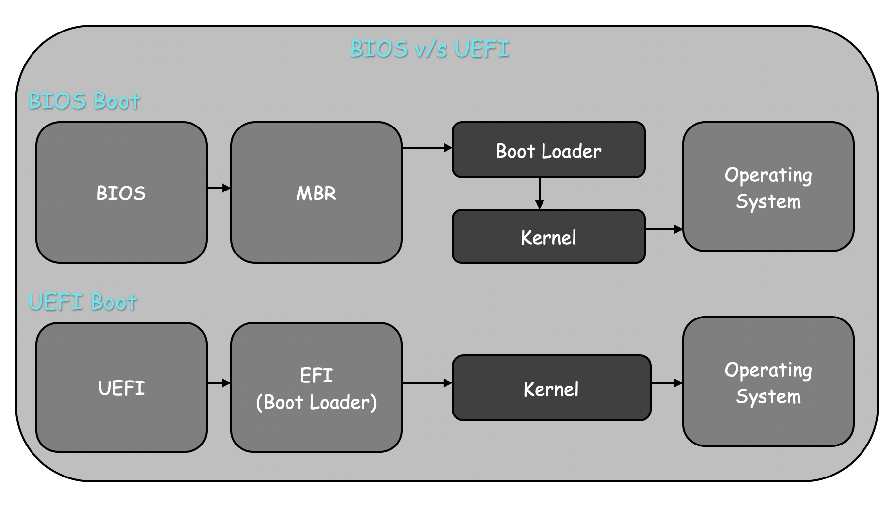
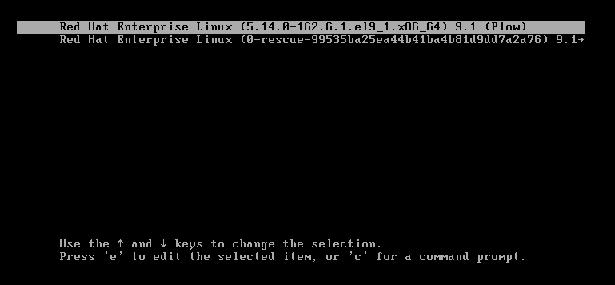
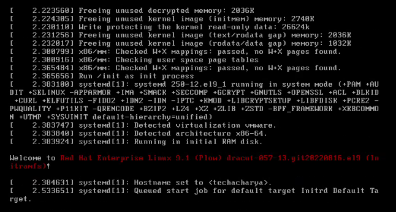
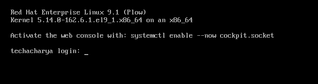
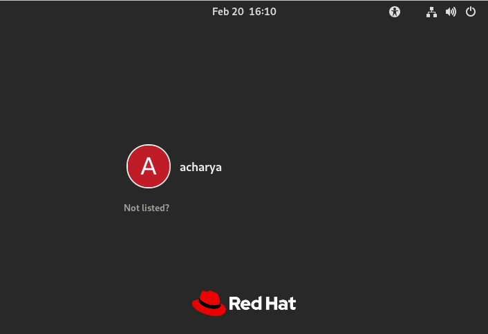

# The Linux System Boot Process

Every linux admins should know, how the linux server boots till the login screen in step by step. So in this lession we will learn the linux server boot process in simple and easy way.

The basic over view of system boot process are shown in below figure.

  

Now we will discuss boot process steps in detail manner which is shown below:
  
  
   
The Linux system boot process can be divided into following steps.
  - BIOS or UEFI
  - MBR if Firmware is UEFI then EFI
  - Boot Loader (GRUB2)
  - Kernel Initialization
  - INIT Process or systemd
  - Runlevel/target Scripts
  - User Interface


### BIOS
  - Basic Input Output System, which is stored in **`read-only`** memory on motherboard and executes first.
  - Performs tartup tasks like the POST **`Power On Self Test`**. Ensures the hardware and peripherals which is necessary for boot is initialized correctly or not. If POST fails, the boot process will not be proceed further step.
  - Checks for bootable device like pendrive, Cd/DVD, Hard Disk, Network Interface, etc.
  - Handover the **`control`** to first srctor of selected/configured boot device i.e. MBR.

### UEFI
  - Unified Extensible Firmware Interface is a set of specifications written by the **UEFI Forum** **` https://uefi.org `**. 
  - It maintains a list of valid boot volumes called **EFI (Extensible Firmware Interface)** System Partitions or **ESP**. 
  - During the **POST** procedure, the **`UEFI firmware`** scans all of the bootable storage devices that are connected to the system for a valid **GUID Partition Table (GPT)**.
  - Globally Unique Identifier (GUID)
  - Unlike the MBR, GPT doesn’t contain a Boot Loader. 
  - The firmware itself scans the GPT to find an EFI System Partition to boot from, and directly loads the kernel from the right partition. 

#### Legacy BIOS v/s UEFI
  | **Legacy BIOS**                                                   | **UEFI**                                                     |
  |-------------------------------------------------------------------|--------------------------------------------------------------|
  | <li>Supports hard disk upto 2.2 TB</li>                           | <li>Supports hard disk upto 9.4 ZB </li>                     |
  | <li>Look for the MBR in the first sector of the Boot Device.</li> | <li>Maintains a list of valid boot volumes i.e. **EFI**</li> |
  | <li>Limits, 16-bit and 32-bit modes </li>                         | <li>It runs in 32-bit and 64-bit modes </li>                 |
  | <li>Doesn't support mouse curser </li>                            | <li>Supports mouse curser </li>                              |
  | <li>Slower </li>                                                  | <li>Faster boot process and has a secure boot feature </li>  |



### MBR (Master Boot record)
  - It's size is 512 B (bytes), first sector of any bootable device contains machine instruction code to boot a machine and having below information:
    - Boot Loader (446 B (bytes))
    - Partition Table (64 B)
    - Error Checking (2 B)
  - It loads the boot loader into the main memory and handover to it.

### EFI (Extensible Firmware Interface)
  - The EFI ( **`Extensible Firmware Interface `** ) System Partition or ESP is a partition on a data storage device.
  - It is an independent partition from OS, where the **UEFI** Boot Loader, application and drivers to be used by **`UEFI Firmware`**.
  - **ESP** is mandatory for UEFI boot.
  - An **ESP** contains the boot loaders or kernel images and device drivers for all installed operating systems.

### GRUB 
  - Stands for GNU GRand Unified Bootloader.
  - Loads ${\color{purple}/boot/grub2/grub.cfg}$ at boot time.
  - At this stage, different OS or kernel options displays to select of choice to boot, if not selected by user then automatically proceed to next with default configured kernel or OS default set time elasped.
  - Once kernel is selected either by user or default, it locates the corresponding kernel file for example **`/boot/vmlinuz-$(uname -r)`**.
  - After locating the kernel, it loads the kernel and initrd/initramfs images as well into the main memory i.e. **RAM**.
  - Once kernel is loaded into the RAM, it passes control to kernel.

  

### Kernel Initialization
  - First of all kernel is loaded into mermory in **`read-only`** mode.
  - initramfs/initrd gets decompressed and then, it first loads temporary filesystem.
  - initrd/initramfs detects and loads the drivers from temporary file-system to actual file-system.
  - Mounts the other file-systems like, LVM, RAID, etc and unmount itself.
  - Once the main file-system is mounted, kernel initialize the first process **`init/systemd`**

  
  
### INIT Process or SystemD
  - Kernel starts the first service/process with **PID 1** i.e. **` systemd `**.
  - **systemd** starts all the required service/process and brings the system to the runlevel/target. 
  - Executes the system to boot into the run level or target as specified in **` /etc/systemd/system/default.target `**.
  - To check default target execute either **`systemctl get-default`** or **`who -r`** or **` runlevel `**
  - Next as per the **fstab** entry file system's integrity is checked and root partition is re-mounted as read-write.


### runlevel or target Scripts
  - Scripts used for runlevels **0** to **6** are located in ${\color{purple}/usr/lib/systemd/system/runlevel}$.
To check all the available targets or run levels in the system execute the below command.
```
$ ls /usr/lib/systemd/system/runlevel*.target -l
```

### Login Interface
Post gone through all the avobe mentioned steps/stages system landed to login interface.
|                                     |                                  |
|-------------------------------------|----------------------------------|
|  | |
