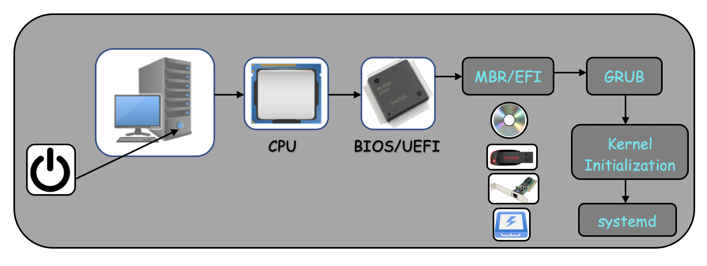
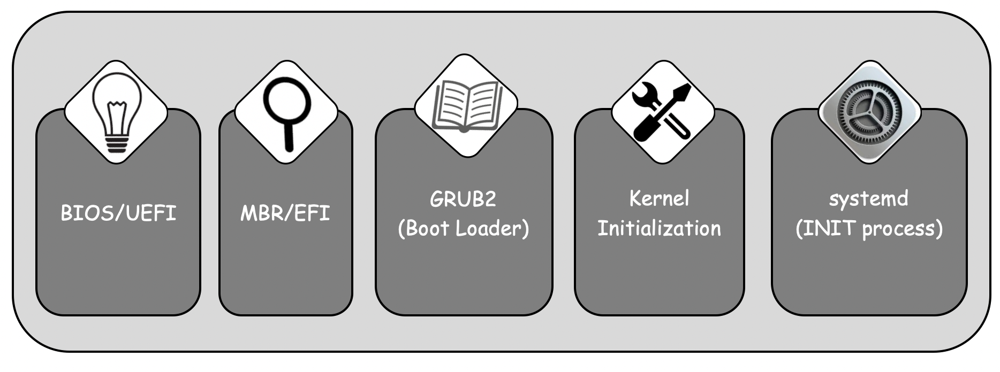

# The Linux System Boot Process

Every linux admins should know, how the linux server boots till the login screen in step by step. So in this lession we will learn the linux server boot process in simple and easy way.

The basic over view of system boot process are shown in below figure.

  

Now we will discuss boot process steps in detail manner which is shown below:
  
  
   
The Linux system boot process can be divided into following steps.
  - BIOS or UEFI
  - MBR if Firmware is UEFI then EFI
  - Boot Loader (GRUB2)
  - Kernel Initialization
  - INIT Process or systemd
  - Runlevel/target Scripts
  - User Interface

### BIOS
  - Basic Input Output System, which is stored in **`read-only`** memory on motherboard and executes first.
  - Performs tartup tasks like the POST **`Power On Self Test`**. Ensures the hardware and peripherals which is necessary for boot is initialized correctly or not. If POST fails, the boot process will not be proceed further step.
  - Checks for bootable device like pendrive, Cd/DVD, Hard Disk, Network Interface, etc.
  - Handover the **`control`** to first srctor of selected/configured boot device i.e. MBR.

### UEFI
  - Unified Extensible Firmware Interface is a set of specifications written by the **`UEFI Forum`**. 
  - UEFI doesn’t look for the MBR in the first sector of the Boot Device.
  - It maintains a list of valid boot volumes called **EFI (Extensible Firmware Interface)** System Partitions or **ESP**. 
  - During the **POST** procedure, the **`UEFI firmware`** scans all of the bootable storage devices that are connected to the system for a valid **GUID Partition Table (GPT)**.
  - Unlike the MBR, GPT doesn’t contain a Boot Loader. 
  - The firmware itself scans the GPT to find an EFI System Partition to boot from, and directly loads the kernel from the right partition. 

### MBR (Master Boot record)
  - It's size is 512 B (bytes), first sector of any bootable device contains machine instruction code to boot a machine and having below information:
    - Boot Loader (446 B (bytes))
    - Partition Table (64 B)
    - Error Checking (2 B)
  - It loads the boot loader into the main memory and handover to it.

### GRUB 
  - Stands for GNU GRand Unified Bootloader.
  - Loads ${\color{purple}/boot/grub2/grub.cfg}$ at boot time.
  - At this stage, different OS or kernel options displays to select of choice to boot, if not selected by user then automatically proceed to next with default configured kernel or OS default set time elasped.
  - Once kernel is selected either by user or default, it locates the corresponding kernel file for example **`/boot/vmlinuz-$(uname -r)`**.
  - 
  - 
