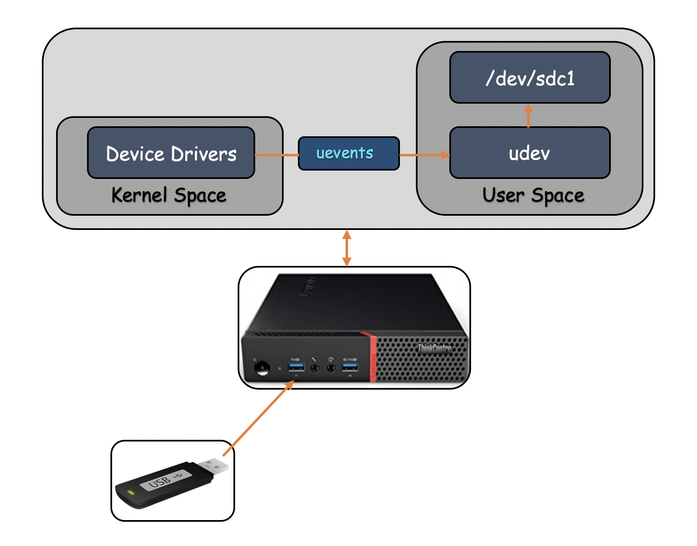
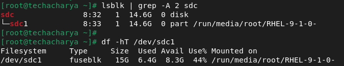
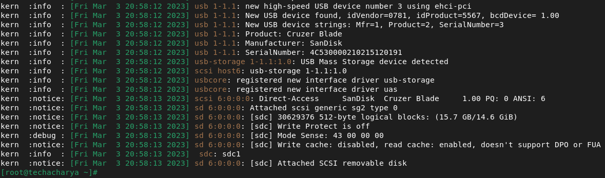
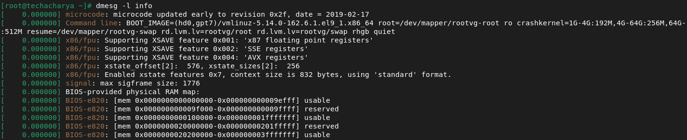
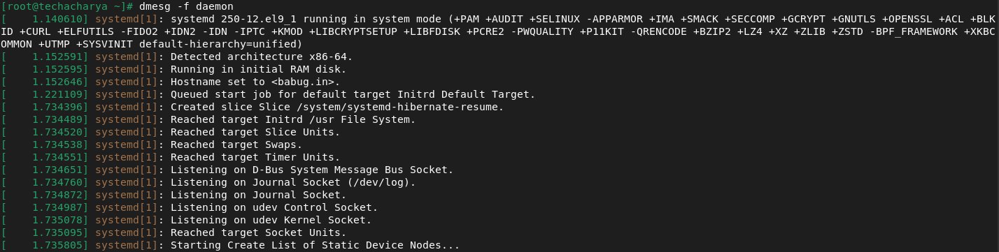
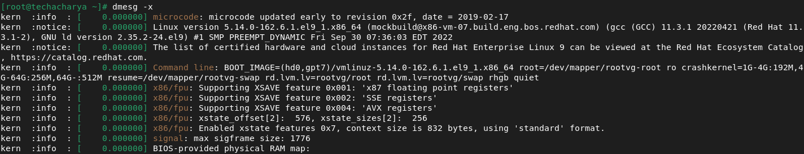
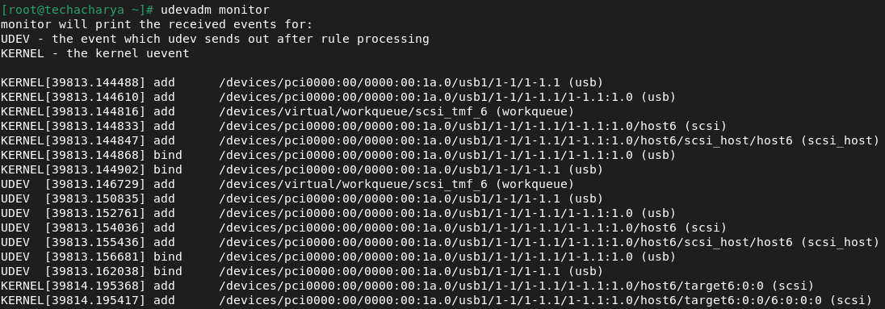
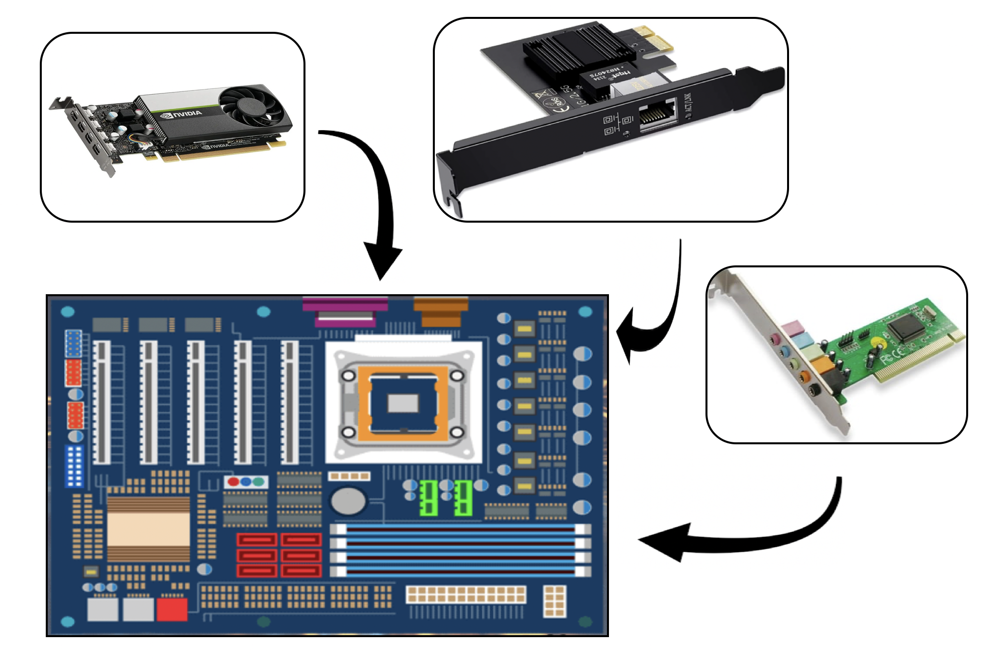
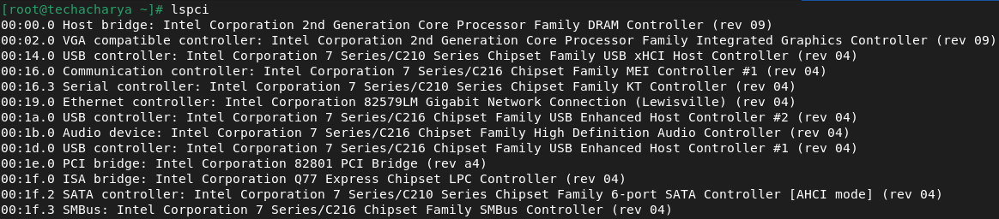
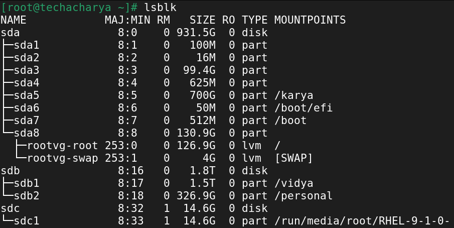

# Communicating with Hardware in Linux System

The **` device driver `** is the abstraction layer between software concepts and hardware circuitry as such, it needs to talk with both of them. In this chapter we will discuss, how a driver can access **` I/O ports `** and **` I/O memory `**. 

Whenever we inserted the devices to the running machine, dynamically a file gets created for that particular device and generally it shows into the **` /dev/ `** directory with some meaningfull name.

Suppose we require to connect **` USB Device `** to the running machine or system. Then **` kernel `** quitely does their job internally and executes the various services to acheve the goals. 
  - Post inserting the **` USB Device `** to the running system or machine the corresponding **device driver** which resides in the **` kernel space `** detects the state change and generates the events which is **` uevents `**.
  - The **` udev `** daemon, **systemd-udevd.service**, receives device **` uevents `** directly from the kernel whenever a device is added or removed from the system or it changes its state.
  - When **` udev `** receives a device event, it matches its configured set of rules against various device attributes to identify the device.
  - **` udev `** supplies the system software with device events, manages permissions of device nodes and may create additional symlinks in the **` /dev/ `** directory.
  - The **` udev `** rules are read from the files located in the directories **` /usr/lib/udev/rules.d `** and **` /usr/local/lib/udev/rules.d `**, the volatile runtime directory **` /run/udev/rules.d `** and the local administration directory **` /etc/udev/rules.d `**.
  - Files in **` /etc/ `** have the highest priority.
  - Once the process is completed the newly inserted or attached device will shwon in the **` /dev/ `** directory with dynamic name created by **` udev `** Dynamic Device Management. 
  - **` udev `** is basically a piece of code or a **User Space** program, which receives signal or notification from **` kernel `**.

  
  
  Now we can see the attached device under **` /dev/ `** directory and can verify by executing below commands:
  ```
  # lsblk
  # df -hT
  ```
  
  
### Operators in udev rules file
| **Operators** | **Description**                                                 |
|---------------|-----------------------------------------------------------------|
| **` == `**    | Compare for equality.                                           |
| **` != `**    | Compare for inequality.                                         |
| **` = `**     | Assign a value to a key.                                        |
| **` += `**    | Add the value to a key that holds a list of entries.            |
| **` -= `**    | Remove the value from a key that holds a list of entries.       |
| **` := `**    | Assign a value to a key finally; disallow any later changes.    |

### **Detect Device Connectivity Status using *` dmesg `* command**
**` dmesg `** can be used to display the message of **` Kernel Ring Buffer `** generated by the **kernel**. The numerous messages generated by the **` kernel `** whenever the linux based system boots up and this is also contains logs which is produced by the hardware devices that the kernel detects and indicate whether it is able to configure them. To identfy or display **` kernel ring buffer `** messages/logs execute the below command.
```
# dmesg
```
**OR** to read in human readable form and with standard date and time.
```
# dmesg -HTx
```


A level is assigned to each message logged to the *` kernel ring buffer `*. The level represents the significance of the information in the communication. The levels are as follows:
| **levels**    | **Description**                                                                      |
|---------------|-----------------------------------------------------------------------|
| **` emerg `** | In this situation not able to use system.                             |
| **` alert `** | Something happened wrong and immediate action required.               |
| **` crit `**  | Critical condition occured like hardware or software related failure. |
| **` err `**   | An error occured related to hardware                                  |
| **` warn `**  | Nothing serious but might indicate some issue.                        |
| **` notice `**| Often report security events.                                         |
| **` info `**  | Startup informational message.                                        |
| **` debug `** | Debug message.                                                        |


The **` dmesg `** command extract the messages that match a particular **level** by using the **` -l `** option and passing the name of the level as a command-line argument.<br>
**Syntax:**
```
# dmesg -l level_name
```
Replace the level_name with desired level.<br>
**Example:**
```
# dmesg -l info
```


To see more than one level based message execute the below command:
```
# dmesg -l info,notice
```
The **` dmesg `** messages are grouped into categories called **facilities**. The list of facilities are as follow:

| **Facilities**  | **Description**                  |
|-----------------|----------------------------------|
| **` kern `**    | Kernel message.                  |
| **` user `**    | User-level message.              |
| **` mail `**    | Logs related to mail system.     |
| **` daemon `**  | Message related to System daemon |
| **` auth `**    | Security and authorization message. |
| **` syslog `**  | Internal syslogd message.           |
| **` lpr `**     | Line printer sub-system.            |
| **` news `**    | Network news sub-system.            |

The **` dmesg `** can filter its output to only show messages in a specific facility. To do so, we must use the **` -f `** option:<br>
**Example:**
```
# dmesg -f daemon
```


We can combine the both **` facility `** and **` level `** togather using **` -x `** option:
```
# dmesg -x
```



### The **` udevadm `**
The **` udevadm monitor `** is a device management tool in linux based system which manages all the device events and it controls the runtime behavior of **` udev `**, requests kernel events, manages the event queue, and provides simple debugging mechanisms.
```
# udevadm info --query=path --name=/dev/sdc1
```
The **` udevadm `** listens to the kernel new uevents upon detecting an event, it displays the details of newly attached or removed device such as the **` device path `** and the **` device name `** on the teminal and so on.
```
# udevadm monitor
```


### Peripheral Connect Interconnect (PCI)
Peripheral Connect Interconnect is a local computer bus for attaching hardware devices in a computer system and is part of the **` PCI Local Bus `** standard. We can connect **` Wi-Fi Adaptor `**, **` Ethernet Card `**, **` Sound Card `**, **` Graphics Card `**, **` RAID Controler `**, etc directly to the **` PCI Slots `** on the motherboard of the compter system.


To list the connected devices to the PCI slots in the system execte below command:
```
# lspci
```


### Peripheral Devices
A peripheral device is any auxiliary device that connects to and works with the computer to either put information into it or get information out of it. There are generally two types of peripheral devices which is **Internal Peripheral** and **External Peripheral** devices and these peripheral devices can be either **` Input Device `** or **` Output device `** or **` Storage Device `**. Few examples of peripheral devices are:
  - Network Interface Card
  - Video Card
  - Wi-Fi Adaptor
  - Keyboard & Mouse
  - RAID Controler
  - Monitor and many more

To list the information about connected **` Block Device `** to the system execute the command below:
```
# lsblk
```


The output of **` lsblk `** command arragned with various fields which is listed below: <br>
**NAME**<br>
The first field is NAME, which shows the device name. <br>
**MAJ:MIN** <br>
This field respectively, indicates the major and minor device numbers. <br>
**RM** <br>
This displays boolean values for removable and non-removable devices.
  - 1  ---> Removal Device
  - 0  ---> Non-removal Device

**SIZE** <br>
This field displays the device size in a readable format, i.e., in K, M, G, T, etc. <br>
**RO** <br>
This field shows the read-only status of a device.
  - 1  ---> Read-only Device
  - 0  ---> No read-only Device

**TYPE** <br>
This field shows the type of devices, such as disk, loopback device, partition, or LVM device. <br>
**MOUNTPOINT** <br>
This displays the mount point on which the device is mounted.


