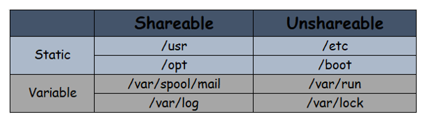

# File Hierarchy Structure in Linux System

Filesystem Hierarchy Standard describes directory structure, which defines the names, locations, and permissions for many file types and directories and its content in Unix and linux based Operating System.

### Purpose
  - Software to predict the location of installed files and directories, and
  - Users to predict the location of installed files and directories.

It is possible to define two independent distinctions among files: shareable v/s. unshareable and variable v/s. static. In general, files that differ in either of these respects should be located in different directories. This makes it easy to store files with different usage characteristics on different filesystems.
  - **Shareable** files are those that can be stored on one host and used on others. 
  - **Unshareable** files are those that are not shareable.
  - **Static** files include **` binaries `**, **` libraries `**, **` documentation files `** and other files that do not change without system administrator intervention. 
  - **Variable** files are files that are not static.
  
