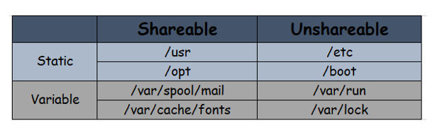

# File Hierarchy Structure in Linux System

Filesystem Hierarchy Standard describes directory structure, which defines the names, locations, and permissions for many file types and directories and its content in Unix and linux based Operating System.

### Purpose
  - Software to predict the location of installed files and directories, and
  - Users to predict the location of installed files and directories.

It is possible to define two independent distinctions among files: **` shareable `** v/s. **` unshareable `** and **` variable `** v/s. **` static `**. In general, files that differ in either of these respects should be located in different directories. This makes it easy to store files with different usage characteristics on different filesystems.
  - **Shareable** files are those that can be stored on one host and used on others. 
  - **Unshareable** files are those that are not shareable.
  - **Static** files include **` binaries `**, **` libraries `**, **` documentation files `** and other files that do not change without system administrator intervention. 
  - **Variable** files are files that are not static.

  
  
Now we will discuss in detail about directories created by the linux system at the time of installation.

### The root filesystem (/)
The contents of the root filesystem **` / `** must be adequate to boot, restore, recover, and/or repair the system.
  - To boot a system, enough must be present on the root partition to mount other filesystems. This includes **` utilities `**, **` configuration `**, **` boot loader `** information, and other essential start-up data.
  - To enable **` recovery `** and/or **` repair `** of a system, those utilities needed by an experienced administrator to diagnose and reconstruct a damaged system must be present on the root filesystem.
  - To restore a system, those utilities needed to restore from system backups must be present on the root filesystem.

The following directories, or symbolic links to directories, are required in **` / `**.
| **Directory** | **Description**                                   |
|---------------|---------------------------------------------------|
| **` bin `**   | Essential command binaries                        |
| **` boot `**  | Static files of the boot loader                   |
| **` dev `**   | Device files                                      |
| **` etc `**   | Host specific system configuration                |
| **` lib `**   | Essential shared libraries and kernel modules     |
| **` media `** | Mount point for removeable media                  |
| **` mnt `**   | Mount point for mounting a filesystem temporarily |
| **` opt `**   | Add-on application software packages              |
| **` sbin `**  | Essential system binaries                         |
| **` srv `**   | Data for services provided by this system         |
| **` tmp `**   | Temporary files                                   |
| **` usr `**   | Secondary hierarchy                               |
| **` var `**   | Variable data                                     |
| **` home `**  | User's home directories (optional)                |
| **` root `**  | Home directory for the root user (optional)       |
| **` run `**   | Run time variable data                            |

### /bin
**` /bin `** contains commands that may be used by both the system administrator and by users. It may also contain commands which are used indirectly by scripts.

### /boot
This directory contains everything required for the **` boot process `** except configuration files not needed at boot time and the map installer. Thus /boot stores data that is used before the kernel begins executing user-mode programs. The kernel must be located in **` /boot `**.

### /dev
The **` /dev `** directory is the location of device files and/or special files.

### /etc
The **` /etc `** the name stands for **` editable text configuration `** contains configuration files. A **` configuration file `** is a local file used to control the operation of a program it must be static and cannot be an executable binary.

### /lib
The **` /lib `** directory contains those shared library images needed to boot the system and execute the commands in the root filesystem, i.e. by binaries in **` /bin `** and **` /sbin `**.

### /media
Default mount point for removable devices, such as USB sticks, media players, cdroms, etc.

### /mnt
This directory is provided so that the system administrator may temporarily mount a filesystem as needed. The content of this directory is a local and should not affect any program is run.

### /opt
The **` /opt `** directory is reserved for the installation of add-on application software packages. A package to be installed in **` /opt `** must locate its static files in a separate **` /opt/<package> `** or **` /opt/<provider> `** directory tree, where <package> is a name that describes the software package and <provider> is the provider’s LANANA (Linux Assigned Names And Numbers Authority) registered name.

### /sbin
Utilities used for **` system administration `** root-only commands are stored in **_/sbin_**, **_/usr/sbin_**, and **_/usr/local/sbin_**. **` /sbin `** contains binaries essential for **_booting_**, **_restoring_**, **_recovering_**, and/or **_repairing_** the system in addition to the binaries in **` /bin `**.
  
### /srv
This directory contains site-specific data which is served by this system. The main purpose of specifying this is so that users may find the location of the data files for particular service, and so that services which require a single tree for readonly data, writable data and scripts can be reasonably placed.

### /tmp
The **` /tmp `** directory must be made available for programs that require temporary files.

### /usr
The **` /usr `** is the second major section of the filesystem. It is shareable, read-only data i.e. **` /usr `** should be shareable between various FHS-compliant hosts and must not be written to. Any information that is host-specific or varies with time is stored elsewhere.  
**_Note:_**  
Large software packages must not use a direct subdirectory under the **` /usr `** hierarchy.

The following directories, or symbolic links to directories in **` /usr `**.

| **Directory**   | **Description**                                |
|-----------------|------------------------------------------------|
| **` bin `**     | Most user commands                             |
| **` include `** | Header files included by C programs            |
| **` lib `**     | Libraries for programming and packages         |
| **` local `**   | Local hierarchy                                |
| **` sbin `**    | Non-vital system binaries                      |     
| **` share `**   | Architecture-independent data                  |
| **` games `**   | Games and educational binaries                 |
| **` libexec `** | Internal binaries that are not intended to be executed directly by users |
| **` src `**     | Source code                                    |
| **` lib64 `**   | For 64-bit libraries                           |
| **` share `**   | Architecture independent data                  |

Command manual pages resides in **_/usr/share/man/_** directory:

| **Directory**   | **Description**        |
|-----------------|------------------------|
| **` man1 `**    | User programs          |
| **` man2 `**    | System calls           |
| **` man3 `**    | Library calls          |
| **` man4 `**    | Special files          |
| **` man5 `**    | File formats           |     
| **` man6 `**    | Games                  |
| **` man7 `**    | Miscellaneous          |
| **` man8 `**    | System administration  |

### /var 
The **` /var `** contains variable data files. This includes spool directories and files, administrative and logging data, and transient and temporary files.

### /home
Contains users account's home directories and user specific configuration files for applications are stored in the user’s home directory in a file that starts with
the **` . `** character.

### /root
The super user **` root `** i.e. system administrator account’s home directory may be determined by developer or local preference, but this is the recommended default location.

### /proc
It is a virtual file-system and contains the **` kernel `** and **` process `** information. Generally, automatically generated and populated by the system, on the fly.

### /lib64
The 64-bit architectures PPC64, s390x, sparc64 and AMD64 must place 64-bit libraries in **` /lib64 `**.

### /run
This directory contains system information data describing the system since it was booted. Files under this directory must be cleared at the beginning of the boot process. 

  

