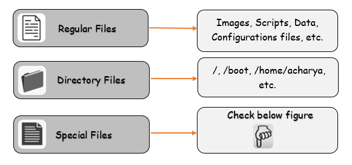
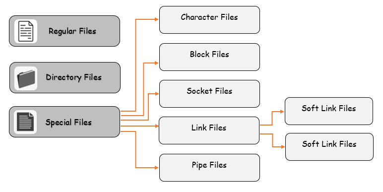
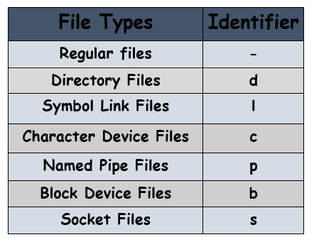

# File types in Linux based system

In Linux based system each and everything is considered as file. Even **` hard disk `**, **` printer `**, **` Network Interface Card `**, etc. is a file in linux based Operating system.

There are mainly three types of files available in linux system.
  - Regular Files
  - Directory files
  - Special Files

  

### Regular Files
Regular Files are general ordinary files in the system  that contains **` programs `**, **` scripts `**, **` texts `**, **` images `**, **` data `** and so on. To check this execute the command:
```
$ ls -ltr | grep ^-
```


### Directory Files
Directory files are those files taht contains the other files and directory and their related information (meta data). To view this execute the below command either **` find / -type d `** or **` ls -ltr | grep ^d `**.
```
$ ls -l | grep ^d
```

### Special Files
Special files are further categorised into different types listed below:
  - Block Files
  - Character Files
  - Socket Files
  - Link Files
    - Soft Link
    - Hard Link
  - Named Pipe files

  
  

### Block Files
Block files act as a direct interface to block devices that performs data **Input** and **Output** operations in units of blocks. These files are hardware files and most of them are present in **` /dev `**. To find out these files execute the below command:
```
$ ls -ltr /dev/ | grep ^b
```

### Character Files
A character file is a hardware file that **` reads/writes `** data character by character and provides a serial stream of input or output and provide direct access to hardware devices. To find out these files execute the below command:
```
$ ls -ltr /dev/ | grep ^c
```

### Socket Files
A socket file is used to pass the information between applications and enables the communication between two processes. To find out these files execute the below command:
```
$ ls -ltr /dev/ | grep ^s
```

### Links Files
Symbol links file points to another file or a folder/directory on linux system. It is like shortcut in windows. To find out these files execute the below command:
```
$ ls -ltr /dev/ | grep ^l
```
There are two types of symbol link file one is **` Soft Links `** and other is **` Hard Links `**.
#### Hard Links
  - Every file on the linux filesystem starts with a single hard link. 
  - The **hard link** is the link between the filename and the actual data stored on the filesystem. 
  - Creating an additional hard link to a file means pointing to the exact same data as the old filename. This means that the two filenames, even though they are different, point to identical data. 
  - Files that are hard-linked together share the same **` inode `** number.
  - Only be created for regular files not for directories and special files.
  - Hard link cannot span over multiple filesystems. <br>

To create hard link execute the below command:

${\color{orange}Syntax:}$
```
$ ln <original file path> <new file path>
```
${\color{orange}Example:}$
```
$ ln /home/acharya/acharya.py /tmp/acharya
```

#### Soft Links
Soft links link together non-regular and regular files and can also span multiple filesystems. To create soft link execute the below command:
${\color{orange}Syntax:}$
```
$ ln -s <file path you want to point to> <new file path>
```
${\color{orange}Example:}$
```
$ ln -s /opt/python3/bin/python3.9 /usr/bin/python
```

### Named Pipe Files
The named pipe file is also known as **` FIFO `** First In First Out and sends data from one process to another so that the receiving process reads the data **` first-in-first-out `** manner.  To find out these files execute the below command:
```
$ ls -l | grep ^p
```

## Identify file types in Linux System
To identify file types in linux system execute the beolow command:<br>
${\color{orange}Syntax:}$
```
$ find / -type <file_identifier>
```
${\color{orange}Examples:}$<br>
To identify character files:
```
$ find / -type c
```
To identify block files:
```
$ find / -type b
```
To identify socket files:
```
$ find / -type s
```
To identify links files:
```
$ find / -type l
```
To identify pipe files:
```
$ find / -type p
```
To identify directory files:
```
$ find / -type d
```




