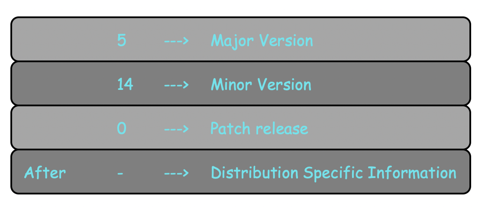

# The Linux kernel

**${\color{green}Kernel}$** is the core component of the Linux based Operating System and has complete control over everything in the system. It always resides in the memory till system shut down and facilitates interactions between hardware and software components. It virtualizes the hardware resources of the machine to provide each process with its virtual resources. This makes the process seem as it is the sole process running on the machine. 

  - Linnux based Operating System uses **Monolithic Kernel**, hence **kernel** carries out process scheduling, device management, memory managemrnt and several operations by itself.
  - The **linux kernel** is also modular, hence it extends its capabilities through the use of dynamically loaded kernel modules without the need to reboot the system. A module can be configured as **built-in** or **loadable**.

  

To better understand the **Linux kernel** in simple language, _think like this:_ The kernel is a busy personal assistant for a powerful CEO/Boss (the hardware). It’s the assistant’s job to relay messages and requests (processes) from employees and the public (users) to the CEO, to remember to attend the meetting or something else (memory), and to determine who has access to the CEO at any given time and for how long.

The linux kernel has four basic major functionalities:
  - ${\color{green}Memory}$ ${\color{green}Management}$ 
    Keep track of how much memory is used to store what, how, and where.
  - ${\color{green}Process}$ ${\color{green}Management}$ 
    Determine which processes can use the central processing unit (CPU), when, and for how long.
  - ${\color{green}Device}$ ${\color{green}Management}$ 
    Act as mediator/interpreter between the hardware and processes.
  - ${\color{green}Security}$ ${\color{green}and}$ ${\color{green}System}$ ${\color{green}Calls}$ 
    Receive requests for service from the processes and maintain the security.

### The Linux kernel Version
To find out the version of your kernel, run **`uname -r`**:

   

In **1994**, Linus started using a new versioning system _i,e._ three variables in the syntax: **` a.b.c `**. Each number, separated by a dot ( **` . `** ) or hyphen ( **` - `** ), is part of a code. If you see anything at all after the dash ( **` - `** ), you are running a distribution kernel.
   

There are several main categories into which kernel releases may fall:
#### Prepatch
They must be compiled from source and usually contain new features that must be tested before they can be put into a stable release.
 
#### Mainline
It's the tree where all new features are introduced and where all the exciting new development happens.

#### Stable
After each mainline kernel is released, it is considered **stable**. An example, here is how the **5.4** development cycle went (all dates in **2019**):
    

**Longterm kernels** are picked based on various factors -- major new features, popular commercial distribution needs, device manufacturer demand, maintainer workload and availability, etc. You can roughly estimate when the new longterm version will become available based on how much time has elapsed since the last longterm version was chosen.

The major version number is incremented when the number after the dot ( **` . `** ) starts looking too big, there is literally no other reason.
 
### Kernel Space & User Space
The kernel, is invisible to the user, working in its own little world known as kernel space, where it allocates memory and keeps track of where everything is stored. What the user sees like, web browsers, other applications and files are known as the user space. These applications interact with the kernel through a **System Call Interface (SCI)**.
![kernel & User mode]

#### Kernel Space

  - Kernel codes
  - Kernel modules
  - Device drivers
  - Security codes and so on.
#### User Space
User space refers to all of the code in an Operating System that lives outside of the kernel. All kinds of utilities, programming languages, scripts and graphical tools - these are user space applications.
  - Mozilla Firefox
  - Java
  - Python
  - C/C++
  - Containers and various applications

| **Kernel Space**                                           | User Space                                             |
|------------------------------------------------------------|--------------------------------------------------------|
| | |

### Application running in User Space
Now we will understand the, how programs/applications run in User Space. There are three important things that developers, architects, and systems administrators, need to know:
  - All applications, inclusive of containerized applications, rely on the underlying **`kernel`**.
  - The kernel provides an API to these applications via **`System Calls`**.
  - Versioning of this API matters as it’s the **glue** that ensures deterministic communication between the **`user space`** and **`kernel space`**.
All processes make system calls:
  

Different types of kernel listed below:
  - **Monolithic Kernel** 
    Monolithic Kernel implements fundamental features of a machine such as managing files, process, memory, and other resources in which all the resources are associated with kernel-space. This increases the size of **Kernel** and the execution of a process is faster.
  - **Mirco Kernel** 
    This type has a minimal features with virtual memory and thread scheduling. It has less services in the kernel space and puts rest in user space. So the kernel size reduces and communication among services is done through message parsing and that reduces the speed of execution.
  - **Hybrid Kernel** 
    It is a combination of both **Monolithic** and **Micro kernel** with the speed and design of a monolithic kernel and the modularity and stability of a microkernel.
  - **Exo Kernel** 
    It handles the allocation of physical resources to applications and allows us to perform application-specific customization. So, It leads to more work for application developers.
  - **Nano Kernel** 
    The code of the kernel is very small and the kernel supports nanosecond clock resolution.

