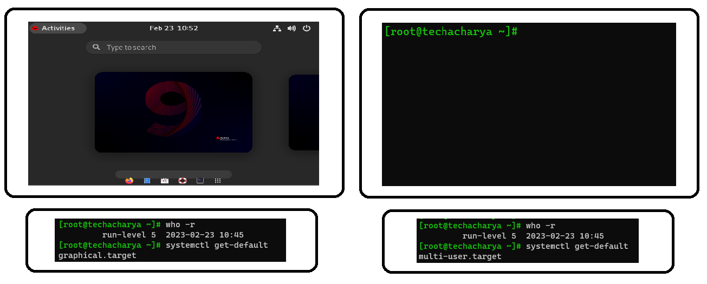
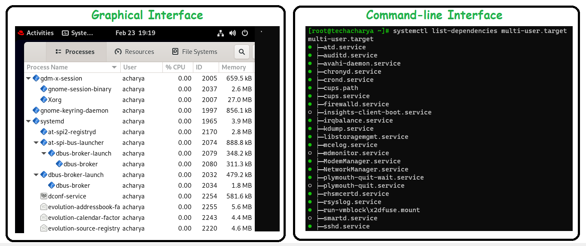

# SystemD or Runlevels

On **Unix-like** Systems, the current operating state of the Operating System is known as a runlevel or target. It defines what system services are running. System can startup to boot in either graphical or command-line mode. Linux machine can operate in various different modes i.e. runlevels or targets.


  - **runlevel 5** operates or boots up the linux system into Graphical mode and
  - **runlevel 3** operates or boots up the linux system into Command-line mode.

To check the running operation mode in the system execute the below command:
```
$ runlevel
```
**OR**
```
$ who -r
```

During boot process **` initd `** or **`systemd `** checks for default configured **runlevel** or **target** and make sure that all the required process or service in that mode are started.

${\color{purple}For}$ ${\color{purple}Example:}$<br>
To start the system into **Graphical Mode** to get graphical interface requires GNOME Display Manager **` gdm.service `** and **Multi User service** as well and many others.
Similarly, to get Command-line interface with multi user it operates into **Command-line Mode** and requires **NetworkManager Service** and many others service.


