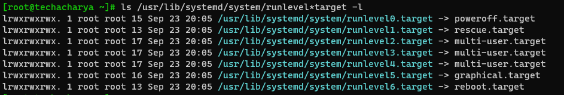

# SystemD or Runlevels

On **Unix-like** Systems, the current operating state of the Operating System is known as a runlevel or target. It defines what system services are running. System can startup to boot in either graphical or command-line mode. Linux machine can operate in various different modes i.e. runlevels or targets.


  - **runlevel 5** operates or boots up the linux system into Graphical mode and
  - **runlevel 3** operates or boots up the linux system into Command-line mode.

To check the running operation mode in the system execute the below command:
```
$ runlevel
```
**OR**
```
$ who -r
```

During boot process **` initd `** or **` systemd `** checks for default configured **runlevel** or **target** and make sure that all the required process or service in that mode are started.

${\color{purple}For}$ ${\color{purple}Example:}$<br>
To start the system into **Graphical Mode** to get graphical interface requires GNOME Display Manager **` gdm.service `** and **Multi User service** as well and many others.<br>
Similarly, to get Command-line interface with multi user it operates into **Command-line Mode** and requires **NetworkManager Service** and many others service.


You can display the default target using the **` systemctl `** command or examine the **` /etc/systemd/system/default.target `** file, which represents the default target unit.
  - To identigy the defaut configured runlevel or target execute the following command:
    ```
    $ systemctl get-default
    ```
  - Determine the default target using the symbolic link:
    ```
    $ ls -l /usr/lib/systemd/system/default.target
    ```

In older version of Linux Systems like, **RHEL 6**, **Ubuntu 14.0**, etc. had a concept of **` runlevels `** but later version of linux based systems replaced with **` targets `**.
## Runlevels
  | **Runlevels** | **Description**                                     |
  |---------------|-----------------------------------------------------|
  | **` 0 `**     | Halt and shut down the machine                      |
  | **` 1 `**     | Single user, rescue mode                            |
  | **` 2 `**     | Multi User mode without NFS or Networking           |
  | **` 3 `**     | Multi User mode                                     |
  | **` 4 `**     | Unused, System admin can set custom runlevel        |
  | **` 5 `**     | Graphical user mode                                 |
  | **` 6 `**     | Reboot the machine                                  |

  
## Targets
Targets are groupings of resources that represent a state the Linux system has reached during startup.
  - Poweroff mode
  - Rescue Mode
  - Multi User mode
  - Graphical Mode
  - Reboot

| **Runlevels** | **Targets**               | **Description**                                                |
|---------------|---------------------------|----------------------------------------------------------------|
| **` 0 `**     | poweroff.target           | power-off or halt the system                                   |
| **` 1 `**     | rescue.target             | Boot the system in rescue or recovery mode.                    |
| **` 2 `**     | multi-user.target         | To boot system into multi-user environment                     |
| **` 3 `**     | multi-user.target         | To boot system into multi-user environment                     |
| **` 4 `**     | multi-user.target         | To boot system into multi-user environment                     |
| **` 5 `**     | graphical.target          | To boot machine into multi-user & graphical environment        |
| **` 6 `**     | reboot.target             | Reboot the machine                                             |



