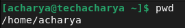
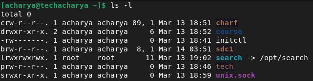
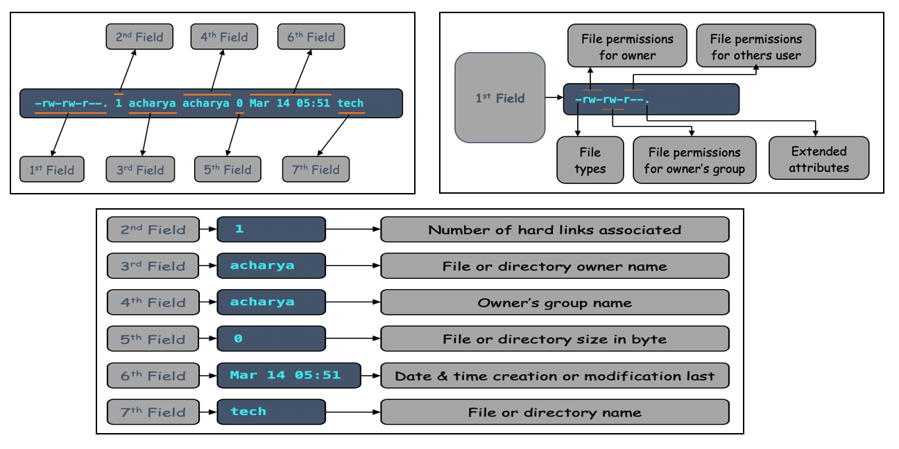
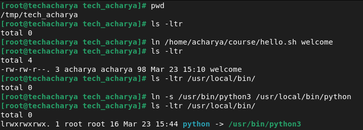
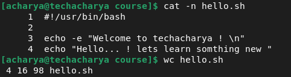
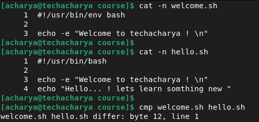
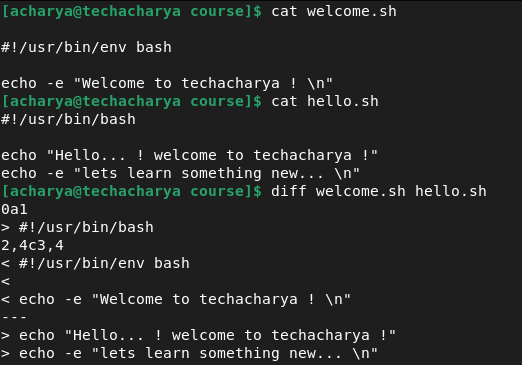
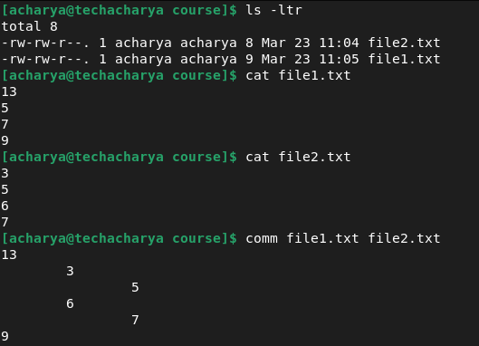

# File Management in Linux System

Everything in linux is treated as file including **_storage/disk device_**, **_printer_**, **_USB Device_**, **_NIC_**, etc. So all the devices and data in linux based system is organized into files. Hence most of the operations are performed on files. And to handle these files linux has directories which, are organized into a tree-like structure. Though, these directories are also a type of file themselves.

That is why in this chapter, we will discuss in detail about file management in linux based system. In linux based system there are three basic types of files are:
  - **_Regular Files:_** like, text files, images, binary files, program files, script files, etc.
  - **_Directory Files:_** Stores directories, regular files and special files 
  - **_Special Files:_** Includes another special files 
    - **_Character Files_**
    - **_Block Files_**
    - **_Link Files_**
      - **_Soft Link_**
      - **_Hard Link_**
    - **_Pipe Files_**
    - **_Socket Files_**

Let’s now deep dive into the basic file management commands that will help you to create and manage your files on linux based system.

### pwd Command
Prints the full filename of the current working directory in a hierarchical order, beginning with the topmost **_root directory_** **_( / )_**. <br>
To display current path or working directory execute the **` pwd `** command as below:
```
$ pwd
```


### cd Command
It changes the current directory to **_dir_** passed as argument to **` cd `** command if **_dir_** is not supplied, the value of the **` HOME `** shell variable is the default. 

To navigate to **_/var/log_** execute the following command:
```
$ cd /var/log
```
To go one directory up or parent directory execute the below command:
```
$ cd ..
```
To navigate to the previous **_present working directory_** execute the below command:
```
$ cd -
```
**_Note:_** <br>
To navigate into a subdirectory or a directory within your current directory, don’t use a forward slash **_( / )_** simply type the name of the directory. <br>
**_Example:_** <br>
To navigate into the **_acharya_** directory execute the below command:
```
$ cd acharya/
```

### Listing the Contents (Files & Directories)
The **` ls `** command lists the information about the existing files in the current directory by default and sort entries alphabetically if none of **_Option_** nor **` --sort `** is specified. 
```
$ ls
```


To list existing contents in long listing format use the **` -l `** option with **` ls `** command as below:
```
$ ls -l
```


Here, the very first line i.e., **_total_** indicates the total size by adding of each files and directories size in current directory.
  - In the first field very first single character of each entry denotes the file types
    | **_Prefix_** | **_Description_**            |
    |--------------|------------------------------|
    | **-**        | Regular file                 |
    | **b**        | Block file                   |
    | **c**        | Character file               |
    | **d**        | Directory file               |
    | **l**        | Link file                    |
    | **p**        | Pipe file                    |
    | **s**        | Socket file                  |
    - In the first filed itself after first character remaining 9 character represents the permissions. 
      - These 9 character further grouped into 3 groups of 3 character each.
      - The 1st 3 character group denotes the owner permission.
      - The 2nd group represents owner's group permission and 
      - Last group denotes others permission which, neither owner nor group member. 
    - In this first field only the 11th character denotes the extended security permission
      - **.** means extended permission is not set.
      - **+** means extended permission (Access Control List) is set
  - The second field represents the number of hard links.
  - The third field denotes the owner (who created the file or directory) name.
  - The fourth field represents the owner's group name.
  - The fifth files indicates the size in bytes.
  - The sixth field represents the date and the time when this file was created or modified for the last time.
  - The last seventh field represents the file or directory name.



### Creating File
In linux system file can be created in many ways. Some conventional methods of file creation are as follow:
  - Using **` touch `** command
  - Using **` printf `** command
  - Using **` cat `** command
  - Using redirection operator **` > `**
  - Using **`echo `** command
  - Using different text editor like, vim, gedit, vi, nano, etc.

  **_Create file using touch command_** <br>
  The **` touch `** command updates the access and modification times of file & directory to the current time. Argument passed to **` touch `** command that does not exist is created empty, unless **_-c_** or **_-h_** is supplied.

To create a empty file **_hello.sh_** ecxecute the below command:
```
$ touch hello.sh
```
To create multiple files at once provide the each file name as argument separated by space to **` touch `** command:
```
$ touch inventory.sh search.py data.txt
```
**_Create file using redirect operator (>)_** <br>
We can also create a file using the redirect symbol/operator **(>)** on the command line. To create a empty file, we just have to type a redirect symbol **(>)** followed by the file name.
```
$ > learn_linux.txt
```

**_Create file using printf command_** <br>
We can also create file using **` printf `** command. To create file using **` printf `** command execute the command as follow:
```
$ printf "Welcome to techacharya !" > acharya.txt
```

**_Create file using cat command_** <br>
The **` cat `** command concatenate files and print on the standard output. We can also use **` cat `** command for many different purposes. <br>
To create file execute the command as belllow:
```
$ cat > tech.txt
```
The above command will create a text file and will enter in the editor mode. Now, enter the desired content and press **_Ctrl + D_** key to save and exit the file or you can simply press **_Ctrl + D_** to create empty file and it will return to the command line.

**_Create file using echo command_** <br>
The **` echo `** command echoing the argument to the standard output. But we can also create file using **` echo `** command. To create a file execute the command as follows:
```
$ echo " " > welcome.txt
```
**OR**
```
$ echo "Welcome to techacharya !" > acharyag.txt
```

**_Create file using editor_** <br>
We can also create file using the various different text editors.
  - **_Using vim editor_** <br>
    **` vim `**  is  a text editor that is upwards compatible to **` vi `**.  It can be used to edit all kinds of plain text and is especially useful for editing programs. We can also create files using it. To create file execute the below **` vim `** command followed by filename:
    ```
    $ vim welcome.sh
    ```
    Post executing above command, it will open the text editor to type the content to it press **i** key. Once file contents are typed just press the **_Esc_** key then type combination of character as **_:wq!_** to save and quit.
    
  - **_Using nano editor_** <br>
    We can also create file using **` nano `** command. To create file execute the **` nano `** command folowed by filename as below:
    ```
    $ nano techacharya.txt
    ```
    It will open the text editor just type your desired file content and press **_Ctrl + O_** to save the content to file and press **_Ctrl + X_** to exit from the editor.
  - **_Using vi editor_** <br>
    We can also create file using **` vi `** text editor. To create file using it execute the commmand as follows:
    ```
    $ vi hello.c
    ```
    Post executing above command, it will open the text editor to type the content to it press **_i_** key. Once file contents are typed just press the **_Esc_** key then type combination of character as **_:wq!_** to save and quit.

### Create Directory
To create a folder anywhere in your file system, use the **` mkdir `** command. Execute the below command to create directory: <br>
**_Syntax:_** <br>
```
$ mkdir directory_name
```
**_Example:_** <br>
```
$ mkdir acharya
```

### Read or view file contents
Reading a file in linux terminal is not the same as opening file in **_notepad_**. Since you are in the command line mode, you should use commands to read file in linux. To read or view the contents of file there are many different commands available in linux system like, **` cat `**, **` nl `**, **` head `**, **` less `**, **` tail `**, etc.

  - To read file contents using **` cat `** command execute the below command:
    ```
    $ cat welcome.txt
    ```
  - Write file contents to standard output, with line numbers added before each line of file. To read file contents using **` nl `** command execute the below command:
    ```
    $ nl techacharya.txt
    ```
  - If file is to large then **` less `** command is more suitable to read file. It allows backward movement in the file as well as forward movement.  Also, less does not have to read the entire input file before starting, views the file one page at a time so with large input files it starts up faster than text editors. You can exit from **` less `** command by pressing **_q_** key. <br>
    To read file execute the following command:
    ```
    $ less /etc/ssh/sshd_config
    ```
  - To output the last part of files i.e., print the last **_10_** lines of file to standard output execute the below command:
    ```
    $ tail -f /etc/ssh/sshd_config
    ```
  - To output the first part of files i.e., print the first **_10_** lines of file to standard output execute the below command:
    ```
    $ head /etc/ssh/sshd_config
    ```
    
### Copy file or directory
Copy i.e., reate the new file in destination with the either same name or different name and same content as that of the file. To copy the file or file's content execute the beloow command: <br>
**_Syntax:_**
```
$ cp source_filename destination_filename
```
**_Example:_**
```
$ cp /etc/ssh/sshd_config /home/acharya/tech.cfg
```
To copy the directory execute the below command:
```
$ cp -r acharya /opt/
```

### Move file or directory
Move or remove the file from the source and would be creating a file with the same content at the destination. To move the file or directory execute the fillowing commnad.
**_Syntax:_**
```
$ mv source_filename destination_filename
```
**_Example:_**
```
$ mv /home/acharya/acharya.txt /opt/
```
To move directory execute the below command:
```
$ mv -r /home/acharya/course /home/tech/
```

### Rename file or directory
We can use the **` mv `** command also to rename the file as well. To rename the file or directory execute the below command: <br>
**_Syntax:_** <br>
```
$ mv filename new_filename
```
**_Example:_**
```
$ mv /home/acharya/welcome.txt /home/acharya/learning.txt
```

### Delete file or directory
To delete or remove the existing file we can use **` rm `** command. Execute the below command to delete the file: <br>
**_Syntax:_**
```
$ rm filename
```
**_Example:_**
```
$ rm /home/acharya/welcome.txt
```
To delete the directory execute the below command:
```
$ rm -r /home/acharya/course
```
### create links or shortcut
If you make two copies of a file or directory, you're in danger of making changes to one and forgetting to make the same change to the other. To ovide this issue we can create the shortcut or links in Linux. To create a shortcut/links, use the **` ln `** command as below:
  - To create soft link execute below command: <br>
    **_Syntax:_** <br>
    ```
    $ ln -s originale_filenmae link_filenmae
    ```
    **_Example:_** <br>
    ```
    $ ln -s /usr/bin/bin/python3 /usr/local/bin/python
    ```
  - To create hard link file execute the below command: <br>
    **_Syntax:_** <br>
    ```
    $ ln original_filenmae link_filename
    ```
    **_Example:_**
    ```
    $ ln /home/acharya/course/hello.sh /tmp/tech_acharya/welcome
    ```

    

### Counting words in file
The **` wc `** command used to get a count of the total number of **_lines_**, **_words_**, and **_characters_** contained in a file. To count lines, words, etc. execute the below command: <br>
**_Syntax:_**
```
$ wc filename
```
**_Example:_**
```
$ wc /home/acharya/course/hello.sh
```


Here, output is in four fields and each denotes different information as bellow:
  - **_1st Field:_** Represents total number of **_lines_** in file.
  - **_2nd Field:_** Denotes total number of **_words_** in the file.
  - **_3rd Field:_** Represents total number of **_bytes_** or **_characters_** in the file.
  - **_4th Field:_** Represents the filename.


### Find difference between two files
If need to compare two files then there is some command present in linux system to find the difference between two files are: **` cmp `**, **` diff `**, **` comm `**, etc.
  - **` cmp `** <br>
    It compares two files byte by byte. To compare two files execute the below command: <br>
    **_Syntax:_** <br>
    ```
    $ cmp first_filename second_filename
    ```
    **_Example:_** <br>
    ```
    $ cmp /home/acharya/course/welcome.sh /home/acharya/course/hello.sh
    ```
    

    First difference finds at **_12th_** byte in the **_1st_** line.

  - **` diff `** <br>
    It compares files line by line. To find the difference between two files execute the below command: <br>
    **_Syntax:_** <br>
    ```
    $ diff first_filename second_filename
    ```
    **_Example:_** <br>
    ```
    $ diff /home/acharya/course/welcome.sh /home/acharya/course/hello.sh
    ```
    
    
    The comparison of the files is labeled, and each label has a number on either side. The format is as follows: <br>
    **_Line number of first_file[Label(a, c, d)]Line number of second_file_** <br>
      - **a** – **_Add:_** Add content in the first file to sync with the second file.
      - **c** – **_Change:_** Indicates that a modification or change required in the content of first file to match the second file.
      - **d** – **_Delete:_** Remove content from the first file to match with the second. <br>
    **_0a1_** Indicates that after line **_0_** in first file add the **_1st_** line of second file. <br>
    **_2d1:_** Indicates to delete line number **_2_** of the first file to match the second file from line number **_1_**. <br>
    Similarly, **_2,4c3,4_** means making a change in the **_2nd_** to **_4th_** line of the first file to match line number **_3rd_** to **_4th_** of the second file. <br>
      - **_Symbol_**
        - **<** Symbol represents **_first file_**.
        - **>** Symbol represents **_second files_**.

  - **` comm `** <br>
    This command compares two sorted files line by line and it will print file's content always in three column. First sort the file before applying **` comm `** command. <br>
    **_Example:_** <br>
    ```
    $ sort first_filename > file1.txt
    $ sort second_filename > file2.txt
    $ comm file1.txt file2.txt
    ```
      - **_1st Column:_** Unique content from first file.
      - **_2nd Column:_** Unique content from second file.
      - **_3rd Column:_** Common content from both the files.

      


