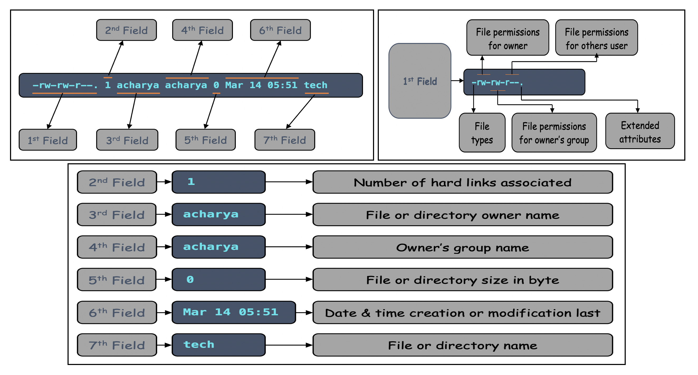

# File Management in Linux System

Everything in linux is treated as file including **_storage/disk device_**, **_printer_**, **_USB Device_**, **_NIC_**, etc. So all the devices and data in linux based system is organized into files. Hence most of the operations are performed on files. And to handle these files linux has directories which, are organized into a tree-like structure. Though, these directories are also a type of file themselves.

That is why in this chapter, we will discuss in detail about file management in linux based system. In linux based system there are three basic types of files are:
  - **_Regular Files:_** like, text files, images, binary files, program files, script files, etc.
  - **_Directory Files:_** Stores directories, regular files and special files 
  - **_Special Files:_** Includes another special files 
    - **_Character Files_**
    - **_Block Files_**
    - **_Link Files_**
      - **_Soft Link_**
      - **_Hard Link_**
    - **_Pipe Files_**
    - **_Socket Files_**

Let’s now deep dive into the basic file management commands that will help you to create and manage your files on linux based system.

### pwd Command
Prints the full filename of the current working directory in a hierarchical order, beginning with the topmost **_root directory_** **_( / )_**. <br>
To display current path or working directory execute the **` pwd `** command as below:
```
$ pwd
```


### cd Command
It changes the current directory to **_dir_** passed as argument to **` cd `** command if **_dir_** is not supplied, the value of the **` HOME `** shell variable is the default. 

To navigate to **_/var/log_** execute the following command:
```
$ cd /var/log
```
To go one directory up or parent directory execute the below command:
```
$ cd ..
```
To navigate to the previous **_present working directory_** execute the below command:
```
$ cd -
```
**_Note:_** <br>
To navigate into a subdirectory or a directory within your current directory, don’t use a forward slash **_( / )_** simply type the name of the directory. <br>
**_Example:_** <br>
To navigate into the **_acharya_** directory execute the below command:
```
$ cd acharya/
```

### Listing the Contents (Files & Directories)
The **` ls `** command lists the information about the existing files in the current directory by default and sort entries alphabetically if none of **_Option_** nor **` --sort `** is specified. 
```
$ ls
```


To list existing contents in long listing format use the **` -l `** option with **` ls `** command as below:
```
$ ls -l
```


Here, the very first line i.e., **_total_** indicates the total size by adding of each files and directories size in current directory.
  - In the first field very first single character of each entry denotes the file types
    | **_Prefix_** | **_Description_**            |
    |--------------|------------------------------|
    | **-**        | Regular file                 |
    | **b**        | Block file                   |
    | **c**        | Character file               |
    | **d**        | Directory file               |
    | **l**        | Link file                    |
    | **p**        | Pipe file                    |
    | **s**        | Socket file                  |
    - In the first filed itself after first character remaining 9 character represents the permissions. 
      - These 9 character further grouped into 3 groups of 3 character each.
      - The 1st 3 character group denotes the owner permission.
      - The 2nd group represents owner's group permission and 
      - Last group denotes others permission which, neither owner nor group member. 
    - In this first field only the 11th character denotes the extended security permission
      - **.** means extended permission is not set.
      - **+** means extended permission (Access Control List) is set
  - The second field represents the number of hard links.
  - The third field denotes the owner (who created the file or directory) name.
  - The fourth field represents the owner's group name.
  - The fifth files indicates the size in bytes.
  - The sixth field represents the date and the time when this file was created or modified for the last time.
  - The last seventh field represents the file or directory name.



### Creating File
In linux system file can be created in many ways. Some conventional methods of file creation are as follow:
  - Using **` touch `** command
  - Using **` printf `** command
  - Using **` cat `** command
  - Using redirection operator **` > `**
  - Using **`echo `** command
  - Using different text editor like, vim, gedit, vi, nano, etc.

  **_Using touch command:_** <br>
  The **` touch `** command updates the access and modification times of file & directory to the current time. Argument passed to **` touch `** command that does not exist is created empty, unless **_-c_** or **_-h_** is supplied.
  


