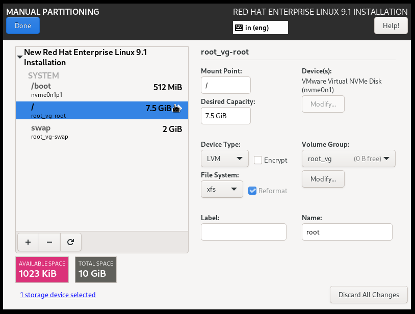

# Install Linux Operating system On Stand-alon Hardware

In this lession we will learn to install linux based operationg system. Installing linux based OS on a **_Server_**, **_Desktop_** or **_laptop_** is easier than you think.

To install Linux on a computer or laptop, you will need:
  - A suitable target device like, **_Server, Virtual Machine, Desktop, Laptop_**
  - A downloaded linux based operating system **_iso_** image file.
  - Installation media or bootable device like, **_CD, DVD, USB Drive,_** etc.

### Overall installation process
Various linux based operating systems or distributions are available in the world like, **_Ubuntu, Fedora, Mint, CentOS, Red Hat_**, etc.
  - **_Step 1:_** Download the linux based OS **_iso_** image file of your choice or need of distribution and version.
  - **_Step 2:_** Create a bootable CD/DVD or USB drive.
  - **_Step 3:_** Boot that media on the target system, and then make a few decisions regarding the installation.

#### Build bootable device
First step is just download linux based OS from whatever site hosts the distribution and version you want. Once you've downloaded linux bsed OS **_iso_**, you'll need a utility that can create a bootable device. To achieve the target you can use **_rufus_**, which is fast, free and easy to use. To download **_rufus_** visit the site https://rufus.ie/en/ .
  - Plug in USB device and then run the **_rufus utility_**.

  
  
  - In the **_Device_** field, at the very top, make sure your USB drive is the one selected. If not, click the pull-down and select it.
  - In the **_Boot selection_** field click on the **` SELECT `** option, navigate to the downloaded linux based OS folder and select the download **_iso_** image file.
  - If you like, you can change the **_Volume label_**, **_Partition scheme_**, **_Target system_** and other provided fields to your choice but it's not necessary. Click **` START `**, then wait while the drive is formatted and the **_iso_** copied or till **_Status_** is **` READY `**.

  - Click on **` CANCLE `** and exit.

#### Get ready to install
Now insert the bootable device into the target system or machine if wnat to install on **_Virtual Machine_** attach the **_iso_** image file under **_CD/DVD_** section in VM settings and power on the target machine. May need to change the **_boot order_**, in **_BIOS Setup_** or **_UEFI Firmware_** which by default almost certainly puts the hard drive first. 

To edit the **_BIOS Setup_** or **_UEFI Firmware_** setting press either **_F1_** or **_F10_** immediately after powering on the machine. It might also be either **_F2_** or **_F9_** or **_F12_** or even the **_Delete_** key depends on the system.

Select the desired option using **↑** and **↓** arrow, to move **_Up_** and **_Down_** use **+** and **-** key respectively and to expand press **_Enter_** key.

Once you've found your way into the **_BIOS Setup_**, find the **_boot_** or **_startup_** menu and make sure **_USB drive_** is first in the boot order. Then save and exit usually by pressing **_F10_** and accepting confirmation.

If everythis is as expected you will land up to the installation menu.

