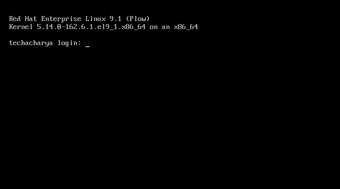

# Install Linux Operating system On Stand-alon Hardware

In this lession we will learn to install linux based operationg system. Installing linux based OS on a **_Server_**, **_Desktop_** or **_laptop_** is easier than you think.

To install Linux on a computer or laptop, you will need:
  - A suitable target device like, **_Server, Virtual Machine, Desktop, Laptop_**
  - A downloaded linux based operating system **_iso_** image file.
  - Installation media or bootable device like, **_CD, DVD, USB Drive,_** etc.

### Overall installation process
Various linux based operating systems or distributions are available in the world like, **_Ubuntu, Fedora, Mint, CentOS, Red Hat_**, etc.
  - **_Step 1:_** Download the linux based OS **_iso_** image file of your choice or need of distribution and version.
  - **_Step 2:_** Create a bootable CD/DVD or USB drive.
  - **_Step 3:_** Boot that media on the target system, and then make a few decisions regarding the installation.

#### Build bootable device
First step is just download linux based OS from whatever site hosts the distribution and version you want. Once you've downloaded linux bsed OS **_iso_**, you'll need a utility that can create a bootable device. To achieve the target you can use **_rufus_**, which is fast, free and easy to use. To download **_rufus_** visit the site https://rufus.ie/en/ .
  - Plug in USB device and then run the **_rufus utility_**.

  
  
  - In the **_Device_** field, at the very top, make sure your USB drive is the one selected. If not, click the pull-down and select it.
  - In the **_Boot _** field click on the **` SELECT `** option, navigate to the downloaded linux based OS folder and select the download **_iso_** image file.
  - If you like, you can change the **_New volume label_** field to your choice but it's not necessary. Click **` Start `**, then wait while the drive is formatted and the **_iso_** installed.

