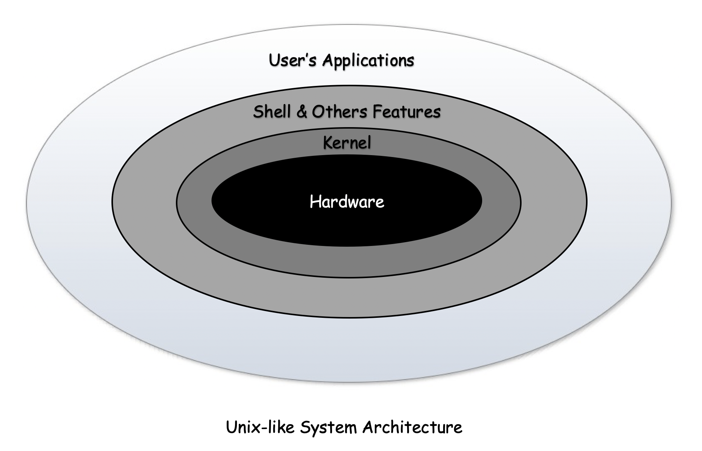

# Introduction to Unix-like System

A Unix-like system is an operating system that behaves in a manner similar to a Unix system, although not necessarily conforming to or being certified to any version of the single Unix specification.

## History of Unix-like System

### Evolution of Unix
  - In the mid **`1960s`**, when the **_Massachusetts Institute of Technology_**, **_AT&T Bell Labs_**, and **_General Electric_** were jointly developing an experimental time-sharing operating system called **_Multiplexed Information and Computing Service_** ( **`Multics`** ) allowing multiple users to access a mainframe simultaneously. Multics introduced many innovations, but also had many problems.

  - **_Bell Labs_**, got frustrated by the size and complexity of **`Multics`** and dissatisfied with the project's progress, hence ultimately management withdrew.

  - Their researchers **_Ken Thompson_**, **_Dennis Ritchie_**, **_Doug McIlroy_**, **_Brian Kernighan_** and **_Joe Ossanna_** decided to redo the work and in **` in 1969 `** launched the **` Unix `** which was much smaller and simpler than **` Multics `**.

  - In **_1973_**, Version 4 **_Unix_** was rewritten in the **` higher-level language C `** to make it portable but still had considerable assembly **PDP-11** dependent code , **AT&T** released Version 5 Unix and licensed it to educational institutions, and licensed **_1975's_** Version 6 to companies for the first time.

  - The availability and portability of **Unix** caused it to be widely adopted, copied and modified by academic institutions and businesses.

  - In **_1977_**, the **` Berkeley Software Distribution (BSD) `** was developed by the **_Computer Systems Research Group (CSRG)_** from UC Berkeley, based on the **` 6th `** edition of **_Unix_** from **_AT&T_**. Since **_BSD_** contained **_Unix_** code that **_AT&T_** owned, **_AT&T_** filed a lawsuit against the **_University of California_**. This strongly limited the development and adoption of **_BSD_**.

  - In **_1983_** the **_Unix_** kernel were rewritten in almost all in **_higher-level language C_** in less than **_20,000_** lines of code and more than 75% was not machine-dependent. By that year **_Unix_** or a **_Unix-like_** system was available for at least **_16_** different processors and architectures from about 60 vendors.

  - In **_1983_**, only **_Richard Stallman_** started the **` GNU project `** with the goal of creating a free **_Unix-like_** operating system. And he wrote the **_GNU General Public License (GPL)_**. By the early **_1990s_**, there was almost enough available software to create a full Operating System. However, the GNU kernel, called **_Hurd_**, failed to attract enough development effort, leaving **_GNU (Generally Not Unix)_** incomplete.

  - In **_1987_**, **` MINIX `**, a Unix-like system for academic use was released by **_Andrew S. Tanenbaum_** to exemplify the principles conveyed in his textbook, **_Operating Systems: Design and Implementation_**.

 

### Evolution of Linux
  - In **_1991_**, a computer science student at **` University of Helsinki `**, **_Linus Torvalds_** began writting the code specifically for his own hardware, he was using and independent of an Operating System because he wanted to use the functions of his new **_PC_** with an **` 80386 processor `**. He has written the code on **` MINIX `** using the **_GNU C Compiler_** that later became the **_Linux kernel_**.

  - **_Torvalds_** first published the **` Linux kernel `** under its own licence, which had a restriction on commercial activity. In **_1992_**, he released the **_kernel_** under the GNU General Public License. 
  - The software to use with the **_kernel_** was developed by the **_GNU project_** licensed under the **` GNU General Public License `**, a free software license.

  - Linux began to gain importance in **_1992_** after the **` X Window System `** was ported to Linux by **_Orest Zborowski_**, which allowed Linux to support a **_GUI_** for the first time.
  - The rest of the Operating System usually includes many GNU libraries, utilities, and other software, from the Free Software Foundation. The operating system as a whole is known as **_GNU/Linux_**.

### Linux in Today's World
**_Linux_** is the leading Operating System on servers (over 96.4% of the top 1 million web servers are running on  Linux based Operating System). Linux also runs on all most all available electronics device like,
  - Embedded Systems i.e. devices whose operating system is typically built into the firmware and is highly tailored to the system. This includes:
    -  Routers, Modems, and Firewalls
    -  Automation controls
    -  Smart home devices
    -  Video game consoles
    -  Smart Televisions
    -  Automobiles Navigation System and GPS (Tesla, Audi, Mercedes-Benz, Hyundai, Toyota and others)
    -  Smartwatches and Fitness Trackers
    -  Thermostats, Smart Fridges, Stoves, and Microwaves
    -  Digital Cameras, Surveillance Cameras, and Electronic Locks
    -  Apacecraft and many more 
  - Android Devices (Ebook Readers, Tablets, and Phones)
  - Supercomputers
  - Servers

## Linux
**_Linux_** is a family of **` free `** (ensures that the end users have freedom in using, studying, sharing and modifying) and **` open-source `** (rights to study, modify the source code and redistribute to others) Unix-like Operating Systems based on the Linux kernel. The Operation System based on **_Linux Kernel_** is termed as linux distribution. Some linux distributions are: Debian, Fedora, SUSE, Gentoo, Red Hat Enterprise Linux, Arch Linux and many more.

### Linux Operating System Architecture
An Operating Pystem (OS) is the system software that manages computer hardware, software resources and provides an environment for the users to execute computer programs. It consists of various components to perform specific task / function shown in below figure:

  


### Kernel Modules

The **_Kernel Modules_** are pieces of code that can be loaded and unloaded into the kernel upon demand. They extend the functionality of the kernel without the need to reboot the system. For example, one type of module is the device driver, which allows the kernel to access hardware connected to the system. Custom codes/modules can be added to **_Linux kernel_** via two methods:

  - The basic way is to add the code to the kernel source file itself and recompile the **_kernel_**.
  - A more efficient way is to add module is by adding code to the **_kernel_** while it is running. A module can be configured as built-in or loadable. To dynamically load or remove a module, it has to be configured as a loadable module in the kernel configuration.

Using modules can save memory, because they are loaded only when the system is actually using them. All parts of the base kernel stay loaded, in real storage, not just virtual storage.

Modules are much faster to maintain and debug.


#### Obtain kernel modules information
Modules are stored in **_/usr/lib/modules/$(uname -r)/kernel_**. You can use the command **`uname -r`** to get your current kernel release version.

**_Note:_** <br>
Module names often use underscores ( **` _ `** ) or dashes ( **` - `**); however, those symbols are interchangeable when using the **modprobe** command and in configuration files in **_/etc/modprobe.d/_**.

You can see what modules are already loaded into the kernel by running **` lsmod `**, which gets its information by reading the file **_/proc/modules_**.
```
$ lsmod
```
To get information about specific module **` modinfo `** command cab be used:
```
$ modinfo module_name
```

#### Module loading
Today, all necessary modules loading is handled automatically by **` udev `**, so if you do not need to use any out-of-tree kernel modules, there is no need to put modules that should be loaded at boot in any configuration file. However, there are cases where you might want to load an extra module during the boot process, or blacklist another one for your computer to function properly.

**_Kernel modules_** can be explicitly listed in files under **_/etc/modules-load.d/_** for **` systemd `** to load them during boot. Each configuration file is named in the style of **_/etc/modules-load.d/program.conf_**. Configuration files simply contain a list of kernel modules names to load, separated by newlines. Empty lines and lines starting with character **` # `** or **` ; `** are ignored.
```
/etc/modules-load.d/virtio-net.conf
------------------------------------------------------------------------------------------------------------------------

# Load virtio_net.ko at boot
virtio_net
```

## Kernel

The **_Linux kernel_** is a free and open-source, monolithic, modular, multitasking, Unix-like operating system kernel. **_Kernel_** is central/core component of an Operating System and generally has complete control over everything in the system. It always resident in memory until Operating System is shut down again and facilitates interactions between hardware and software components. It is responsible for various tasks such as:
  - Device management
  - Memory Management
  - Process Management
  - Security & System Calls

#### _Memory Management_
Keep track of how much memory is used to store what, how, and where.

#### _Device Management_
Act as mediator/interpreter between the hardware and processes.

#### _Process Management_
Determine which processes can use the **Central Processing Unit (CPU)**, when, and for how long.

#### _Security & System Calls_

Receive requests for service from the processes and provide the approperiate security among various processes.

  - The **_kernel_**, is invisible to the user, working in its own little world known as **_kernel space_**, where it allocates memory and keeps track of where everything is stored. System components, Libraries and user's application like, Web browsers, shell, files, etc are known as the **_user space_**. These applications interact with the kernel through a **_System Call Interface (SCI)_**.


### kernel within the OS
To put the kernel in context, you can think of a **_Linux_** machine as having 3 layers:
  - **_The hardware:_** <br> 
The physical machine — the bottom or base of the system, made up of memory **_(RAM)_** and the processor or central processing unit **_(CPU)_**, as well as input/output **(I/O)** devices such as storage, networking, and graphics. The CPU performs computations and reads from, and writes to, memory.
  - **_The Linux kernel:_** <br> 
The core of the OS. It’s residing in memory that tells the **CPU** what to do.
  - **_User processes:_** <br>
These are the running programs that the **kernel** manages. User processes are what collectively make up **user space**. The **kernel** also allows these processes and servers to communicate with each other known as **_Inter-process Communication, or IPC_**.



Code or program executed by the system runs on **_CPUs_** in 1 of 2 modes: **_kernel mode_** or **_user mode_**. Code running in the **_kernel mode_** has unrestricted access to the hardware, while **_user mode_** restricts access to the **_CPU_** and **_memory_** to the **_SCI_**. A similar separation exists for memory (**_kernel space_** and **_user space_**). These 2 small details form the base for some complicated operations like privilege separation for security, building containers, and virtual machines.


### Kernel Types
The types of kernel are as follow:
  - **_Monolithic Kernel –_** <br>
The simplest and most common type of **kernel**, the user and kernel services are implemented in the same memory space. It has huge lines of code which is complex.
  - **_Micro Kernel –_** <br>
Include only the essential services and devices required for the system to function and hence, results in a smaller kernel that is faster and uses less memory. It has separate **User Space** and **kernel Space**.
  - **_Hybrid Kernel -_** <br>
Combinnation of both **monolithic** and **microkernel** and it borrows speed from the monolithic kernels and modularity from microkernel.
  - **_Exo Kernel -_** <br>
This Kernel has separate resource protection and management, suitable for use when performing **application-specific** customization.
  - **_Nano Kernel -_** <br> 
Smallest type of **kernel**, consisting of only a few thousand lines of code. Code executing in the privileged mode of the hardware is minimal. They are used primarily in embedded systems or devices with limited resources.

## Shell
A **_Shell_** is a **_command-line_** interpreter or piece of code that provides a command line user interface for **_Unix-like_** Operating Systems. It accept human readable commands from computer user and convert them into something which kernel can understand. The shell is both an interactive **_command language_** and a **_scripting language_**, and is used by the Operating System to control the execution of the system using shell scripts.

There are several shells are available for **_Uinux-like systems_** like –
  - ksh (Korn Shell)
  - csh (C Shell, Syntax sinilar to C language)
  - sh (Bourne shell)
  - bash (Bourne Again shell) and many more

List of all the available shells in **_Unix-like_** system is present in the **_/etc/shells_** file.
```
$ cat /etc/shells
```
  - Path Name : /bin/{sh | bash | csh | ksh} or /usr/bin/{sh | bash | csh | ksh}
  - Prompt for the **_root user_**: **` # `**
  - Prompt for the **_non-root user_**: **` $ `**

## System Libraries
System Libraries are special functions or programs (pre-compiled pieces of code that can be reused in a program) using which application programs or system utilities accesses **_kernel's_** features. 

### Library File Extensions
**_Uinux-like_** System has a variety of library files in many locations. Learning the names, locations, and purposes of some of these libraries may help users and admins better understand their Linux system.
  - *.a - These are statically linked libraries.
  - *.bin - These libraries are binary files.
  - *.fw - Firmware files are special libraries/drivers for hardware.
  - *.o - Many loadable kernel modules/objects are object files.
  - *.so - These files are dynamically-linked shared libraries that are not linked put into programs. Rather, programs reference this library and obtain functions/code from it.

System libraries are found in **_/lib/_**  and **_/lib64/_** directory.

## Linux System Utility Tools
The Linux System utility tool is a collection of various **_command-line_** and **_GUI_** peice of software or program. The **_GUI_** programs are written by **_GNU Project_** and ported to linux based Operating System to make it efficient to use for the end users and make it freely available to everyone by published under **_GPL_**. It helps to analyze, configure, optimize or maintain a computer system. Some list of tools are mentioned below:
  - ACL's
  - Network Utility (nmcli, etc)
  - Package Manager (rpm, yum, apt, etc)
  - Cryptographic
  - System Monitors and many more.

## The User's Applications
The Operating System based on linux kernel consists of a wide variety of essential applications that can be used to perform many day-to-day tasks. It is not required for Operating System but neccessary to end-users. Some user applications are listed below:
  - Web browser (Mozilla Firefox, etc)
  - Audio/Video player (Videos, etc)
  - Editor (vi, vim, etc)
  - Remote access tool (ssh, etc) and many more.

## The Terminal
The Linux terminal is a text-based interface ( a rectangular box or window/frame) used to control a linux computer. It is the standard way to interact with a Linux server.
  - Takes input from the user in the form of commands.
  - Displays output on the screen.

Terminal is a dumb thing so it does not know what to do with the input, so it needs another program to process it, and in most cases, it’s the **_Shell_**. Post writing commands on the **_terminal_**, when we press the **` Enter key `**, the terminal passes those commands to another program to figure out what the user wants to do, and in most cases, that program is the Shell, which performs the following functions:
  - Interprets the command given by the end-user.
  - Checks the syntax of the command and then Checks whether the command is correctly used or not.
  - If everything is correct, the shell converts the command into a **_kernel_** understandable form and passes it to the **_kernel_**. Else, It returns an error message.
  - The **` $ `** or **` # `** prompt appears on the terminal waiting for the next command, rrrespective of whether the previous commands were correct or not.


