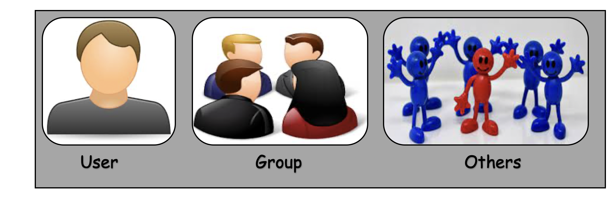
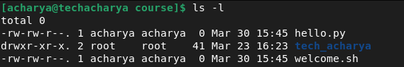
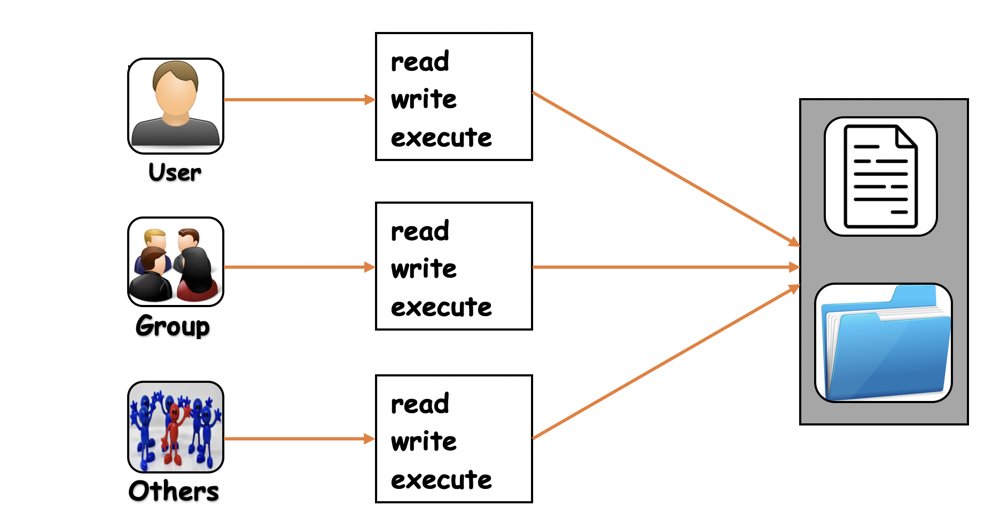
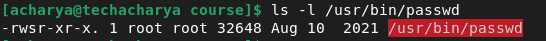

# File Permissions in linux Systems

Linux is the **_multi-user_** operating system which can be accessed by many users simultaneously. But this raises security concerns as an unsolicited or malign user can corrupt, change or remove crucial data. For effective security, linux divides authorization into two levels.
  1. **_Ownership_**
  2. **_Permission_**

     

### File and Directory Ownership
Each and every file/directory is owned by a specific user or UID and a specific group or GID. Every file and directory on Unix/Linux system is assigned 3 types of owner, listed below.
  - **_User:_** <br>
    A user is the one who created the file. By default, whosoever, creates the file becomes the owner of the file. User can create, delete, or modify the file.
  - **_Group:_** <br>
     A group can contain multiple users. All the users belonging to a group have same access permission for file or directory.
  - **_Other:_** <br>
    Any one who has access to the file or directory other than user and group comes in the category of other. Other has neither created the file nor is a group member.
    

 
### File and Directory Permission
File permissions are core to the security model used by linux systems. They determine who can access files and directories on a system and how. This article provides an overview of linux file permissions, how they work, and how to change them.

#### View File and Directory Permission
To view file or directory permission execute the **` ls `** command along with its **` -l `** (for long listing) option will show you metadata about linux files, including the permissions set on the file and directory.
```
$ ls -l
```


In above example, you see three different content entry. The first field of the **` ls -l `** output is a group of metadata that includes the permissions on each file. Here are the components of the **_hello.py_** listing:
  - File type: **_-_**
  - Permission settings: **_rw-rw-r--_**
  - Extended attributes: **_._**
  - Number of hard links: **_1_**
  - User owner: **_acharya_**
  - Group owner: **_acharya_**
  - Size in block: **_0_**
  - Last modified or created date and time: **_Mar 30 15:45_**
  - File or directory name itself: **_hello.py_**

#### Read file and Directory Permission
The **_permission settings_** on a file or directory has the set of permissions for owners (user, group and others) to **` read `**, **` write `** and **` execute `**. The interesting permissions from the **_hello.py_** listing are as follow:
```
rw-rw-r--
```
This above string is actually an expression of three different sets of permissions:
  - **_rw-_**    — Owner
  - **_rw-_**    — Group
  - **_r- -_**   — Others

The first set of permissions applies to the **_owner_** of the file. The second set of permissions applies to the **_user group_** that owns the file. And the third set of permissions is generally referred to as **_others_**. All linux files belong to an owner and a group.



The characters are represent the meaning as follows:
  - **_r_** = Read permission
  - **_w_** = Write permission
  - **_x_** = Execute permission
  - **_-_** = Represents no any permission applied

#### File and Directory Access Proceedure
When the system is looking at a file's permissions to determine what information provide to **_user_** when the **_user_** interact with a file, it runs through a series of checks:
  1. It first checks whether you are the user that owns the file. If so, then you are granted the user owner's permissions, and no further checks will be carried out.
  2. If you are not the user that owns the file, next your group membership is validated to check whether you belongs to the group that matches the group owner of the file. If so, then you're covered under the group owner field of permissions, and no further checks will be made.
  3. **_Others_** permissions are applied when the account interacting with the file is neither the **_user owner_** nor in the **_group_** that owns the files.


#### Octal values for Permissions
When linux file permissions are represented by numbers, it's called numeric mode. In numeric mode, a three-digit value represents specific file permissions (for example, **_764_**.) and these are called octal values. The first digit is for **_owner_** permissions, the second digit is for **_group_** permissions and the third one is for **_others_**. Each permission has a numeric value assigned to it:
  - **_r_** (read): **4**
  - **_w_** (write): **2**
  - **_x_** (execute): **1**

In the permission value **_764_**, the first digit corresponds to the **_user/owner_**, the second digit to the **_group_**, and the third digit to **_others_**. By adding up the value of each user classification, you can find the file permissions.
  - **Owner:** rwx = 4 + 2 + 1 = 7
  - **Group:** rw- = 4 + 2 + 0 = 6
  - **Others:** r-- = 4 + 0 + 0 = 4

The results produce the three-digit value **764**.

#### Explaining Permissions
Now we are going to explain what do these permissions actually do in practice ?
  - **_read (r) permission_** <br>
    Read permission is used to access the file's contents. It is required to make copies of a file, because you need to access the file's contents to make a duplicate of it.
  - **_write (w) permission_** <br>
    Write permission allows you to modify or change the contents of a file. It also allows you to use the redirect or append operators in the shell (**>** or **>>**) to change the contents of a file. Without write permission, changes to the file's contents are not permitted.
  - **_execute (x) permission_** <br>
    Execute permission allows you to execute the contents of a file. It also allows to run **_Shell scripts, Python programs_**, and a variety of interpreted or compiled languages.

    This permission is very different on **_directories_** compared to **_files_**. Having execute permission on a _directory_ authorizes you to look at extended information on files in the directory using **` ls -l `** but also allows you to change your working directory using **` cd `**. 


#### Modify file and directory permission
You can modify file and directory permissions with the **` chmod `** command, which stands for **_change mode_**. 
  - To change file permissions in numeric mode, enter **` chmod `** and the octal value you desire, such as **_775_**, followed by the file name. 
    ```
    # chmod 755 welcome.sh
    ```
  - To change file permissions in symbolic mode, enter a user class and the permissions you want to grant them preceded by the file name.
    ```
    # chmod ug+rwx hello.py
    # chmod o+r hello.py
    ```
    This above commands grant read, write, and execute for the **_user_** and **_group_** and only read for **_others_**.
    
    | **_Operator_**  | **_Description_**                                              |
    |-----------------|----------------------------------------------------------------|
    | **+**           | Adds permission to a file or directory                         |
    | **–**           | Removes the permission                                         |
    | **=**           | Sets the permission and overrides the permissions set earlier. |
    
    The owners are represented as follows:
    | **_Symbol_**        | **_Description_**           |
    |---------------------|-----------------------------|
    | **_u_**             | User or Owner               |
    | **_g_**             | Group                       |
    | **_o_**             | Others                      |
    | **_a_**             | All (owner + group + others)|

### Special Permission
Special permissions (**_SetUID, SetGID_** and **_Sticky Bit_**) are available for files and directories and provide additional privileges over the standard permission sets that have been covered. It make up a fourth access level in addition to **_user, group_**, and **_other_**. 
  - **_SetUID (user + s)_** <br>
    Commonly noted as **_SUID_**, the special permission for the user access level has a single function. A file with **_SUID_** always executes as the user who owns the file, no matter who is passing the command. If the file owner doesn't have execute permissions, then use an uppercase **_S_** here.
    
  - **_SetGID (group + s)_**
  - **_Sticky Bit (other + t)_**


