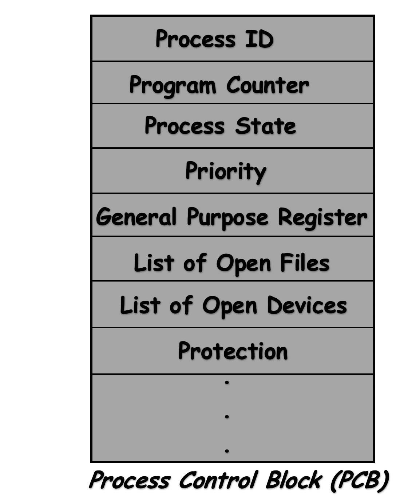
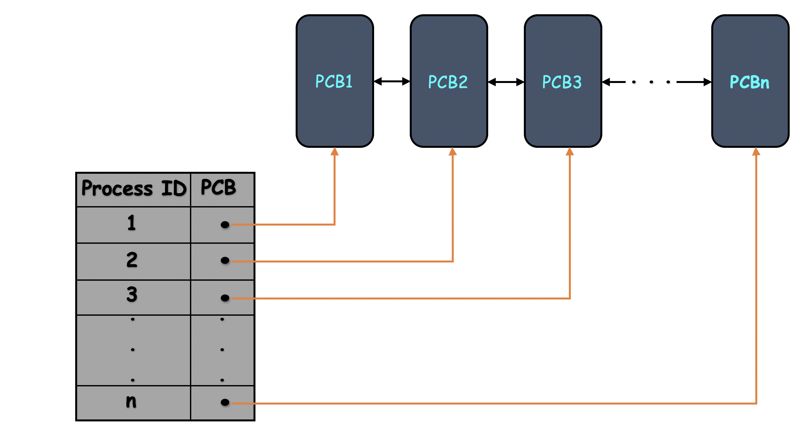
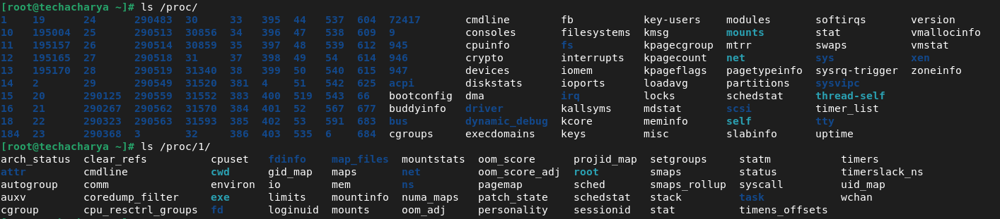

# Process Management and Monitoring in `linux` System
A process is basically a program in the execution. _For example:_ Suppose we have a **_C language_** program file _**` welcome.c `**_ and this program file will be given to the **_C language Compiler_** like _**` gcc `**_. Compiler will just convert this **_high level language_** (source code) to **_low level language_** (machine code) that is a binary code or file, which is directly executes on the hardware and provides the appropriate result.

The original code and binary files or codes both are called program only and generally reside in the secondary storage device i.e., **_HDD/SSD_**. In order to exeute this program Operating System loads this program into the **_main memory_** i.e., **_RAM_** and starts executing it. When program loads into **_main memory_** it creates data structures into the **_RAM_** and this structure is called as process.


  - **_Executables/text_**

    This section of memory contains the executable codes which are being executed or the current activity represented by the value of the **_Program Counter_**.
  - **_Static Local or Global variable_**

    This section contains all the **_local_** and **_global_** variables defined in the program. 
  - **_Stack_**

    Most of the program has the function calls or recursion . So the stack require to contain the temporary data, such as function parameters, returns addresses, and local variables.
  - **_Heap_**

    Program also has dynamic array, linked lists, etc. So heap requires to conatin the dynamically allocated memory to process during its execution time. 
    
This structure of memory is known as process boundary and eveythig required by the particular process will lies in this boundary only. While **_Operating System_** executing this particular process should never cross these boundaries. This boundary is called process.

**A process consists of:** 
  - An address space of allocated memory
  - Security properties including ownership, credentials and privileges
  - One or more threads of program code
  - Process states

**The environment of process includes:**
  - Golbal and local variables
  - A current scheduling context
  - Allocated system resources, such as file descriptors and network ports, etc.

### Identification of Process
There are number of process created in the system randomaly at any point of time in that senerio we are supposed to keep track of which process is what, how many process are there and what is the current state of a particular process. So to identify a particular process among various process there is a set of attribute are recorded at specific location called **_Process Control Block_** or **_PCB_**. <br>
**_Attributes of Process:_** <br>
  - **_Process ID_**
  - **_Program Counter_**
  - **_Process State_**
  - **_Priority_**
  - **_General Purpose Register_**
  - **_List of Open Files_**
  - **_List of Open Devices_**
  - **_Protection_**

  

#### Process ID
A unique numerical identification number assigned by the operating system to the process.
#### Program Counter
It is a register in **_CPU_** and contains that memory address from where the next instruction is to be fetched for execution.
#### Process State
The state of a process is the current activity of the process. The process states are:
  - **_New_**
  - **_Ready_**
  - **_Running_**
  - **_Block or Wait_**
  - **_Termination or Completion_**
  - **_Suspend ready_**
  - **_Suspend wait or Suspend block_**
#### Priority
It shows the importance of the process and generally it is a number.
#### General Purpose Register
The intermediate result present in registers is keep tracked while process is preempted or moved to waiting state.
#### List of Open Files
During the execution of process files are open for reading or writing purpose. So it keeps records of all the open files.
#### List of Open Devices
It keeps records of all open devices like printers, disk, etc.
#### Protection
It defines the area of memory allocated for the process. Any process should not access the other process's allocated memory space.


**_Operating System_** creates a _**` Process Control Block `**_ PCB for each and every process and this **_PCB_** contains all the process attributes to manages it. These all **_PCBs_** are represented in the linked list. In the linux kernel, each process is represented by a _**` task_struct `**_ in a **_doubly-linked list_**, the head of which is _**` init_task `**_.



**Context Switching** <br>
This **_Process Control Block_** is also known as context. The process of saving the **_context_** of one process and loading the **_context_** of another process is called _**` Context Switching `**_. This may happen when:
  - _A high-priority process comes to a ready state than the running process_
  - _An Interrupt occurs_
  - _User-mode and kernel-mode switch_
  - _Preemptive CPU scheduling used._


These all information related to process can be seen in the directory _**` /proc/PID/ `**_.


### Process Types
There are two types of process in linux system:
  - **_User Process_**
  - **_System Process_**

#### User Process
User processes are executed in user mode and can be preempted or suspended at the time of executing. It executes the user code.
#### System Process
System processes are executed in privileged mode and executed automatically as per requirement without preemption. It executes the system code.

### Ways of running Process
There are two ways to run the process in linux system:
  - **_Foreground Process_**
  - **_Background Process_**

#### Foreground Process
Processes that require a **_user_** to start them or to interact with them are called _foreground processes_. It needs certain inputs from the user and gives some output on the screen. Such way of running processes are also known as _interactive processes_. Programs and commands run as foreground processes by default.

#### Background Process
Processes that are run independently of a user are referred to as background processes. To run a process in the background, place an ampersand **_(&)_** symbol at the end of the command name that you use to start the process. Such ways of running processes are also known as _non-interactive processes_.

### Manage Process
To understand the process management going to start the _**` sleep `**_ process for **_500_** seconds. This approach allows you to see the process without making meaningful changes to the system.
```
$ sleep 500
```
Post executing the above command stop the process with **_Ctrl + Z_** so that we can use our terminal.
