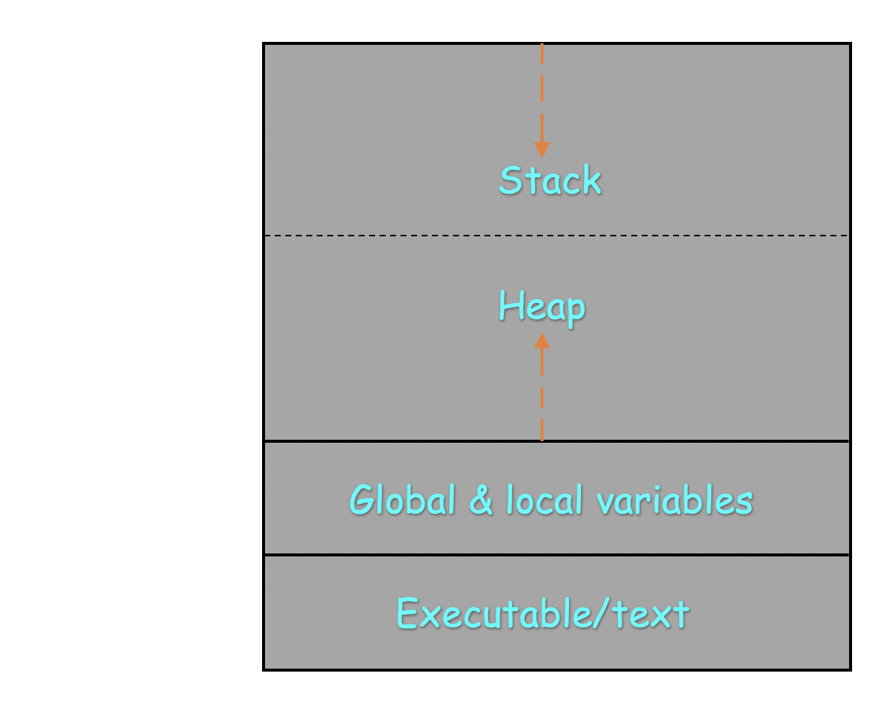

# Process Management and Monitoring in `linux` System
A process is basically a program in the execution. _For example:_ Suppose we have a **_C language_** program file _**` welcome.c `**_ and this program file will be given to the **_C language Compiler_** like _**` gcc `**_. Compiler will just convert this **_high level language_** (source code) to **_low level language_** (machine code) that is a binary code or file, which is directly executes on the hardware and provides the appropriate result.

These original code and binary files or codes both are called program only and generally reside in the secondary storage device i.e., **_HDD/SSD_**. In order to exeute this program Operating System loads this program into the **_main memory_** i.e., **_RAM_** and starts executing it. When program loads into **_main memory_** it creates data structures into the **_RAM_** and this structure is called as process.

  - **_Executables/text_**
    This section of memory contains the executable codes which are being executed or the current activity represented by the value of the **_Program Counter_**.
  - **_Static Local or Global variable_**
    This section contains all the **_local_** and **_global_** variables defined in the program. 
  - **_Stack_**
    Most of the program has the function calls or recursion . So the stack require to contain the temporary data, such as function parameters, returns addresses, and local variables.
  - **_Heap_**
    Program also has dynamic array, linked lists, etc. So heap requires to conatin the dynamically allocated memory to process during its execution time. 
    
This structure of memory is known as process boundary and eveythig required by the particular process will lies in this boundary only. While **_Operating System_** executing this particular process should never cross these boundaries.

