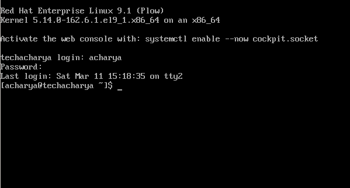
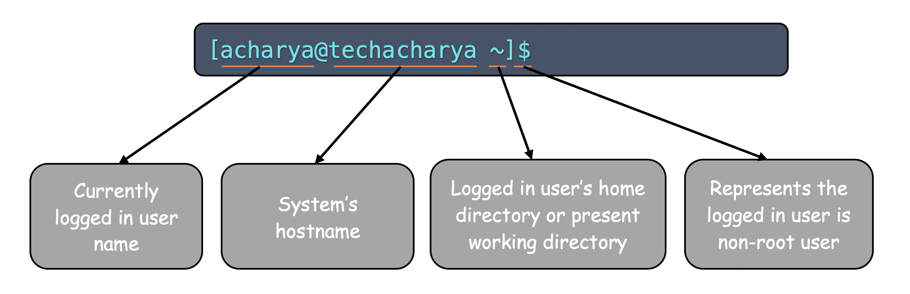

# Accessing the linux Command-line Terminal

Once we have done with the linux based operating system installation the next step is to access the linux command-line terminal. The power of linux system actually lies in it's command-line mode. Graphical User Interface is very simple to learn and use. There are two different method by which command-line can be accessed:
  - Text mode
  - GUI mode

If you're at the physical console or in the case of a **_Virtual Machine_**, the virtual console, you'll either get a login prompt if the system set defaults to the **` multi-user.target `** or a nice GNOME login window if it set defaults to the **` graphical.target `**.

### Using text mode
For many reasons, linux system may be configured to boot to a text login. If linux system is installed with the **_Minimal install_** environment, it won't have a graphical mode at all. You can also set the system to default to **` multi-user `**, even if a **_GUI_** is there.

Getting to a command prompt is easy. Just enter your username don't forget it's case-sensitive; **_acharya_** and **_Acharya_** are not the same. Press **` Enter `**, and then type your password. Don't panic if you don't see any stars or other input as you type; **_linux_** doesn't display any password placeholder characters.

Here, **[acharya@techacharya ~]$** represents the below details:  
**_acharya_**     ---> is the logged in user name  
**_techacharya_** ---> is a hostname  
**_~_**           ---> represents the logged in user's home directory or the present working directory and  
**_$_**           ---> denotes that logged in user is **_non-root_** user inplace of **$** if it is **#** then represents **_root_** user.

