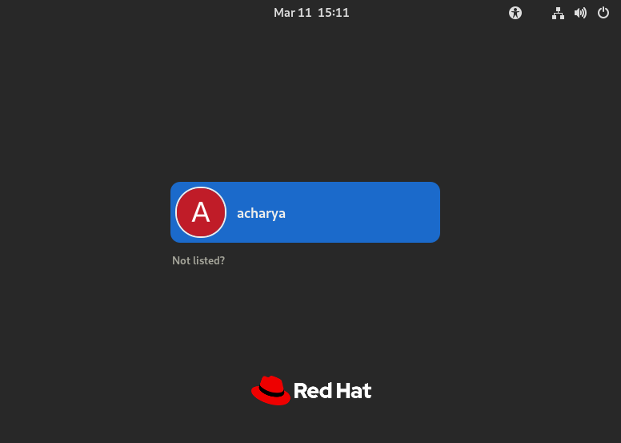
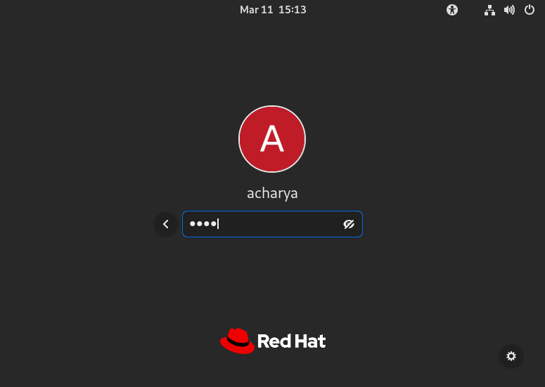
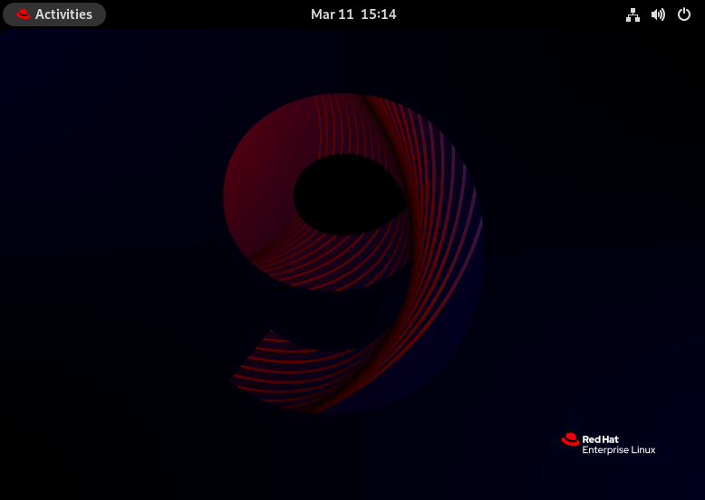
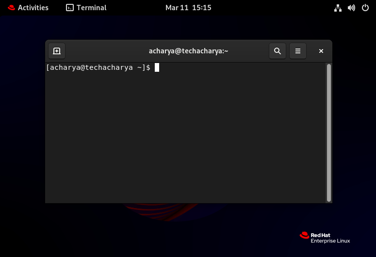
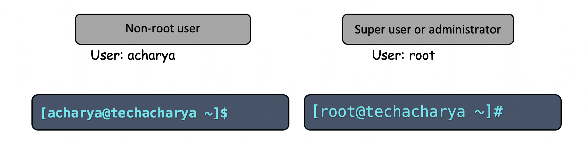
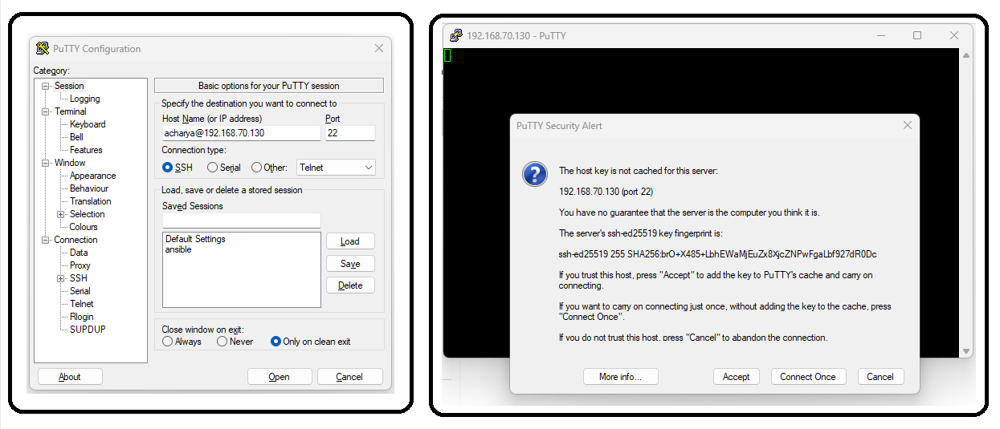
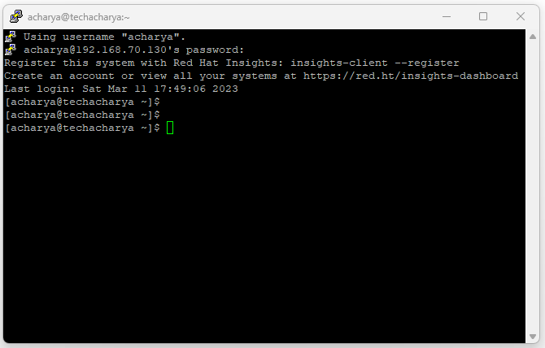
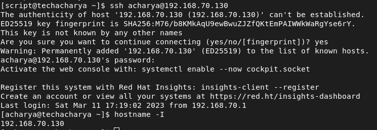
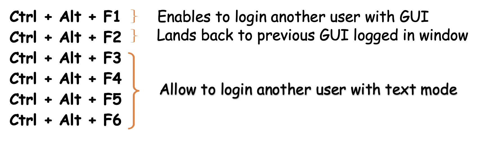
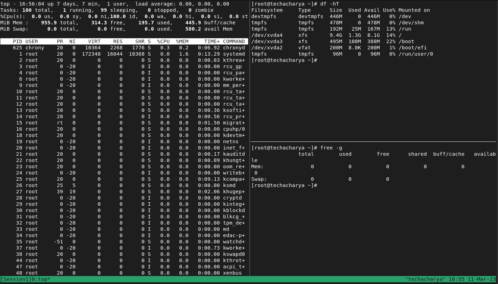

# Accessing the linux Command-line Terminal

Once we have done with the linux based operating system installation the next step is to access the linux command-line terminal. The power of linux system actually lies in it's command-line mode. Graphical User Interface is very simple to learn and use. There are three different method by which command-line can be accessed:
  - Text mode
  - GUI mode
  - Remote access over Secure Shell 

If you're at the physical console or in the case of a **_Virtual Machine_**, the virtual console, you'll either get a login prompt if the system set defaults to the **` multi-user.target `** or a nice GNOME login window if it set defaults to the **` graphical.target `**.

### Using text mode
For many reasons, linux system may be configured to boot to a text login. If linux system is installed with the **_Minimal Install_** environment, it won't have a graphical mode at all. You can also set the system to default to **` multi-user `**, even if a **_GUI_** is there.

Getting to a command prompt is easy. Just enter your username don't forget it's case-sensitive; **_acharya_** and **_Acharya_** are not the same. Press **` Enter `**, and then type your password. Don't panic if you don't see any stars or other input as you type; **_linux_** doesn't display any password placeholder characters.


### Using GUI mode
If linux system is installed with **_Server with GUI_** base envirnment , it should include the **` X Window System `**, which is the **_GUI_**. The login looks as you might expect. Just select your username in the list to be prompted for your password. 



Type the password you will see dots as you enter your password here, unlike at the text login and press the **` Sign In `** button or hit **` Enter `**.



This process gets you to the desktop, but you're not at a command prompt yet. To access the command prompt click on the **` Activities `** menu in the upper-left.




Now click on the **_Terminal_** icon in the bottom menu in **_GNOME_** shell.


This step launches the **_GNOME Terminal_**, and now you're at a command prompt.




Here, **[acharya@techacharya ~]$** represents the below details: <br>
**_acharya_**     ---> is the logged in user name <br>
**_techacharya_** ---> is a hostname <br>
**_~_**           ---> represents the logged in user's home directory or the present working directory and <br>
**_$_**           ---> denotes that logged in user is **_non-root_** user inplace of **$** if it is **#** then represents **_root_** user.


### Super user and non-root user
Super user or administrator and not-root user can be differenciate by looking the either user name or by command prompt



### Remote access over Secure Shell 
In real world **_linux sysadmin_** often access the command prompt remotely only. Linux in text-mode configuration offers an almost identical experience when accessing the system remotely. Assume you are accessing your linux system from another system that could be either **_linux machine_** or **_Windows machine_** or from **_Mac OS_**. All you need to know is **_username_**, **_password_**, and the remote system's _**IP address or hostname_**. just follow the following:
  - From **_Windows system:_** open the **` Command Prompt (CMD) `** and type: <br>
    **_Syntax:_**
    ```
    > ssh username@linux_system-IP or hostname
    ```
    **_Example:_**
    ```
    > ssh acharya@192.168.70.130
    ```
    Accept the fingerprint by typing **_yes_** and hit **_Enter_** then provide ther **_acharya_** user's password. And you will land to linux command prompt. <br>

    If **_ssh_** command is not installed in **Windows** then you can use the **_putty Utility_** to access linux system. <br>
    Just download the **_Putty Utility_** and run the putty and fill the **_username_**, **_hostname or IP adsress_** of remote linux system and click on **` Open `** and then **` Accept `** the fingerprint.
    

    Now it's time to provide user's password, post entering the password press **_Enter_** key and you will land to command prompt.

    
  - From another **_Linux system_** just launch the command prompt and type the following:
    ```
    $ ssh acharya@192.168.70.130
    ```
    
  - From **_Mac OS_** just launch terminal and follow the same step as access from **_linux system_**.


### Exit or Logout from Terminal
There are a few ways to disconnect from it properly:
  - You can type either **` exit `** or **` logout `** and press **_Enter_**. 
  - Or you can press **` Ctrl + D `** on your keyboard.

### Virtual Terminal
A virtual or pseudo terminal allows a machine to connect to a remote server, usually to allow different user login or to run different application on single machine at a time. You can switch between these terminals using key combination **` Ctrl + Alt + f1 `** to **` Ctrl + Alt + f6 `**.



### Terminal Multiplexer (tmux)
**` tmux `** is a **_Terminal Multiplexer_** which, allows to create several **_pseudo terminals_** from a single terminal. This is very useful for running multiple programs with a single connection, such as when you're remotely connecting to a machine using **_Secure Shell (SSH)_**.

You can detach **` tmux `** from the current terminal, and all your programs will continue to run safely in the background. Later, you can reattach tmux to the same or a different terminal.

Some of **_tmux's_** features are as follows:
  - Fully customizable status bar
  - Multiple window management
  - Splitting window in several panes
  - Automatic layouts
  - Panel synchronization
  - Scriptability, which allows to create custom **_tmux_** sessions for different purposes




