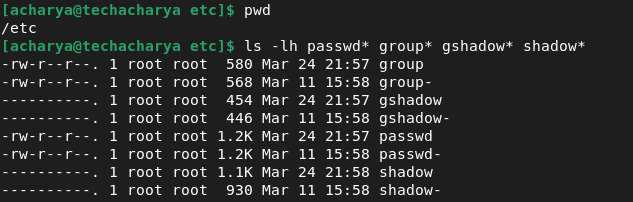
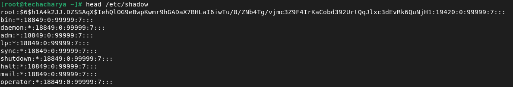

# Local User and Group Management

The control of _users_ and _groups_ is a core element of linux system administration. This chapter explains:
  - **_add_**
  - **_manage and_**
  - **_delete users and groups_**
  - **_creating group directories_**.

### Users
**_Users_** can be either people i.e., accounts tied to physical users or accounts that exist for specific applications to use. Hence, in linux system there are two types of user:
  1. **Physical User**
     - **_Superuser or root_**
     - **_Regular User_**
  2. **Service User or System User**

**_Superuser or root User_** <br>
The _superuser or root_ user is a king of linux system and is automatically created during the installation. It administrats the whole linux system and can access any service or resource in the linux sysytem. It has the highest privilege and should be used only for administrative purpose not for daily routine activities. The **_root_** user can't be deleted, if requir can be disabled.

**_Regular User_** <br>
This is a normal user and can be created as many as required post linux system installation. It has moderate privilege and intended to daily routine activities. Regular user can perform only the tasks for which it is allowed and can access only those files and services for which it is authorized. As per requirement, it can be disabled or deleted.

**_Service User_** <br>
Ther service or system users are a special type of non-human privileged account used to execute applications and run automated services. These users are created by installation packages or application software when they are installed. These accounts are neither intended for routine activities nor should be used for routine work. By default, the **_User Manager_** does not display the system users.
 


  - Each user is associated with a _Unique numerical Identification Number_ which, is a user identification **_(UID)_**. 
  - _User_ who creates a file is also the owner and group owner of that file.
  - The file is assigned separate _read, write,_ and _execute_ permissions for the **_owner, group,_** and **_others_**. 
  - The file owner can be changed only by **_root_** user and access permissions can be changed by both the _**root**_ user and file **_owner_**.

### Groups
**_Groups_** are logical expressions of organization, tying users together for a common purpose. Users within a group share the same permissions to _read_, _write_, or _execute_ files owned by that group.
  - Like **_user_**, each **_group_** is associated with a group ID _**(GID)_**.

### Reserved User & Group IDs
In linux system **_user_** and **_group_** _IDs_ below **1000** is reserved for _system users_ and _groups_. Reserved **_user_** and **_group_** _IDs_ are documented in the setup package. To view the documentation, execute the below command:
```
$ cat cat /usr/share/doc/setup/uidgid | less
```
To make the **_IDs_** assigned to new users by default start at desired **_IDs_** value, change the **_UID_MIN_** and **_GID_MIN_** directives in the **_/etc/login.defs_** file.


**_Note_** <br>
For users created before changed **_UID_MIN_** and **_GID_MIN_** directives, **UIDs** will still associated at the default **_1000_**.

### User Private Group (UPG)
The linux system uses a **_User Private Group (UPG)_** scheme, which makes **_Unix/Linux_** groups easier to manage. It is created whenever a new user is added to the linux system and has the same name as the user for which it was created and that user is the only member of the **_user private group_**. 


**_UPG_** make it safe to set default permissions for a newly created file or directory, allowing both the **_user_** and the **_group_** of that user to make modifications to the file or directory. The **_umask_** determines what permissions are applied to a newly created file or directory and is configured in the **_/etc/bashrc_** file. 

The list of all groups is stored in the **_/etc/group_** configuration file.

### Users and Groups Management Files
In linux system the main four files are used to store the **_users_** and **_groups_** inforamation and all these files are present in the **_/etc/_** directory. These files are: **_passwd_**, **_shadow_**, **_group_** and **_gshadow_**.

Since the entire user management system is controlled through these files, linux system itself maintains and updates the backup of each file in the same directory with same name followed by hyphen (**-**). The followig table shows the backup files along with original files:

| **_Files_**        | **_User's Inforamation_**  | **_Password Aging Policy_** | **_Group's Information_** | **_Group's Encrypted Password_**|
|--------------------|----------------------------|------------------------------|---------------------------|---------------------------------|
| **_Original File Name_** | passwd               | shadow                       | group                     | gshadow                         |
| **_Backup File Name_**   | passwd-              | shadow-                      | group-                    | gshadow-                        |




**passwd File** <br>
This files contains list of all user's account and each individual row stores a single user's details and has the seven fields separated by colon (**:**). To display the content of passwd file execute the command **_cat /etc/passwd_** or **_head /etc/passwd_** so on.


These seven fields are as follows:
  - **_1st Field:_** It is a user name itself.
  - **2nd Field:_** It is a pointer to encrypted user password to the **_/etc/shadow_** files.
  - **_3rd Field:_** It is user ID.
  - **_4th Field:_** It is a group ID.
  - **_5th Field:_** It is a information about user.
  - **_6th Field:_** It is a user's home directory.
  - **7th Field:_** This is a login shell name with full path assigned to user.


**shadow File** <br>
This file contains secure user account information. It holds the user's encrypted password and password related information. Just like **_/etc/passpwd_** file this file also stores each user entry in individual row and each row conatins nine different fields separated by colon (**:**).



In environments with multiple users, it is very important to use _shadow passwords_ provided by the **_shadow-utils_** package to enhance the security of system authentication files.

**_Features_**
  - Shadow passwords improve system security by moving encrypted password from the world-readable **_/etc/passwd_** file to **_/etc/shadow_** file, which is readable only by the **_root_** user.
  - It stores the information related to password aging.
  - This allows to enforce some of the security policies set in the **_/etc/login.defs_** file.

**_Information in shadow file_**
Following nine information is stored in the shadow file for each user is:
  - **1st Field:_** It is the user name itself.
  - **_2nd Field:_** This field sores the encrypted password. In encrypted password there are three dollar symbol (**$**):
    - Between **_1st_** & **_2nd_** dollar signs - type of encryption.
      - **_$1$_** - MD5 encryption
      - **_$2$_** - Blowfish encryption
      - **_$3$_** - Blowfish encryption
      - **_$5$_** - SHA-256 encryption algorithm
      - **_$6$_** - SHA-512 encryption algorithm
    - Between **_2nd_** & **_3rd_** dollar signs - is a salt (random data which, used as an additional input to a _one-way_ function that hashes data, a password or passphrase. Salts are used to safeguard passwords in storage).
    - Post **_3rd_** dallar sign - hash itself.
  - **_3rd Field:_** It is the date of the last password change. The number of days is calculated based on epoch **_(Jan 1st, 1970)_**. If **0** in this field means that the user must change password on the next login.
  - **_4th Field:_** This field is the minimum password age which means the number of days that has to pass before the user can be permitted to make changes to the password again. The value **_0_** means password can be changed at any time.
  - **_5th Field:_** It is the maximum password age i.e., the maximum number of days the password is valid, after that user is forced to change their password again.
  - **_6th Field:_** It is the password warning period which means, the user will be warned for number of days before the password will expire, this is the password warning period.
  - **_7th Field:_** This seventh field is the password inactivity period. It is the time in days when an expired password is still accepted and after this period password expires.
  - **_8th Field:_** It is the account expiration date. The date of expiration of the account, expressed as the number of days since **_Jan 1, 1970 _**.
  - **_9th Field:_**


