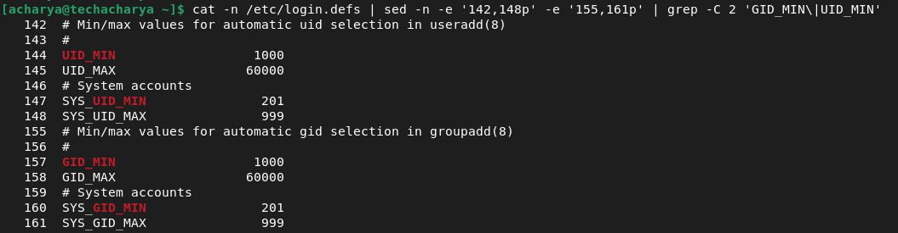

# Local User and Group Management

The control of _users_ and _groups_ is a core element of linux system administration. This chapter explains:
  - **_add_**
  - **_manage and_**
  - **_delete users and groups_**
  - **_creating group directories_**.

### Users
**_Users_** can be either people i.e., accounts tied to physical users or accounts that exist for specific applications to use. Hence, in linux system there are two types of user:
  1. **Physical User**
     - **_Superuser or root_**
     - **_Regular User_**
  2. **Service User or System User**

**_Superuser or root User_** <br>
The _superuser or root_ user is a king of linux system and is automatically created during the installation. It administrats the whole linux system and can access any service or resource in the linux sysytem. It has the highest privilege and should be used only for administrative purpose not for daily routine activities. The **_root_** user can't be deleted, if requir can be disabled.

**_Regular User_** <br>
This is a normal user and can be created as many as required post linux system installation. It has moderate privilege and intended to daily routine activities. Regular user can perform only the tasks for which it is allowed and can access only those files and services for which it is authorized. As per requirement, it can be disabled or deleted.

**_Service User_** <br>
Ther service or system users are a special type of non-human privileged account used to execute applications and run automated services. These users are created by installation packages or application software when they are installed. These accounts are neither intended for routine activities nor should be used for routine work. By default, the **_User Manager_** does not display the system users.
 


  - Each user is associated with a _Unique numerical Identification Number_ which, is a user identification **_(UID)_**. 
  - _User_ who creates a file is also the owner and group owner of that file.
  - The file is assigned separate _read, write,_ and _execute_ permissions for the **_owner, group,_** and **_others_**. 
  - The file owner can be changed only by **_root_** user and access permissions can be changed by both the _**root**_ user and file **_owner_**.

### Groups
**_Groups_** are logical expressions of organization, tying users together for a common purpose. Users within a group share the same permissions to _read_, _write_, or _execute_ files owned by that group.
  - Like **_user_**, each **_group_** is associated with a group ID _**(GID)_**.

### Reserved User & Group IDs
In linux system **_user_** and **_group_** _IDs_ below **1000** is reserved for _system users_ and _groups_. Reserved **_user_** and **_group_** _IDs_ are documented in the setup package. To view the documentation, execute the below command:
```
$ cat cat /usr/share/doc/setup/uidgid | less
```
To make the **_IDs_** assigned to new users by default start at desired **_IDs_** value, change the **_UID_MIN_** and **_GID_MIN_** directives in the **_/etc/login.defs_** file.



**_Note_** <br>
For users created before changed **_UID_MIN_** and **_GID_MIN_** directives, **UIDs** will still associated at the default **_1000_**.

### User Private Group (UPG)
The linux system uses a **_User Private Group (UPG)_** scheme, which makes **Unix/Linux_** groups easier to manage. It is created whenever a new user is added to the linux system and has the same name as the user for which it was created and that user is the only member of the **_user private group_**. **_UPG_** make it safe to set default permissions for a newly created file or directory, allowing both the **_user_** and the **_group_** of that user to make modifications to the file or directory. 

The **_umask_** determines what permissions are applied to a newly created file or directory and is configured in the **_/etc/bashrc_** file. 


